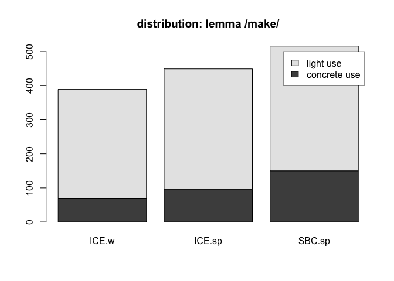
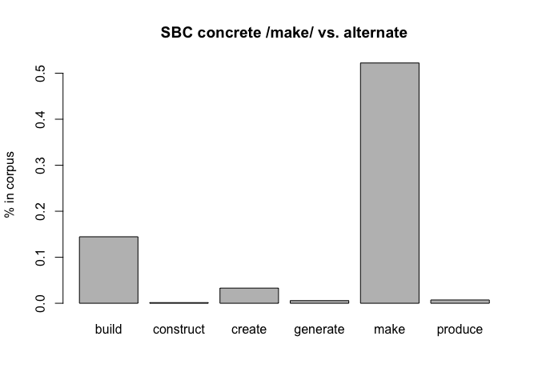

# term paper draft
polysemous verbs with light and concrete senses, replication study of [@mehl_what_2021](https://doi.org/10.1515/cllt-2017-0039), further used: [@gilquin_what_2008](https://dial.uclouvain.be/pr/boreal/object/boreal:75833)

## init
"If onomasiological frequency measurements do indeed correlate with elicitation tests, 
potential impact would be immense. Researchers would be able to examine onomasiological frequencies in spoken corpora rather than performing elicitation tests. That possibility would facilitate cognitive research into languages and varieties around the world, without the necessity of in situ psycholinguistic testing, and would also encourage the creation of more spoken corpora." ([@mehl_what_2021 p.23](https://doi.org/10.1515/cllt-2017-0039))

## method
following corpus was used to determine frequencies:   

Q.1: Santa Barbara corpus of spoken American English, ([@ucsb_santa_2005](https://www.linguistics.ucsb.edu/research/santa-barbara-corpus))

the corpus data was downloaded from: [https://www.linguistics.ucsb.edu/sites/secure.lsit.ucsb.edu.ling.d7/files/sitefiles/research/SBC/SBCorpus.zip](https://www.linguistics.ucsb.edu/sites/secure.lsit.ucsb.edu.ling.d7/files/sitefiles/research/SBC/SBCorpus.zip)

### script used: 

[14015.concrete-abstract_HA.R](14015.concrete-abstract_HA.R)

### process:

- distribution analysis, cf. [@mehl_what_2021 pp.11-14]

Table: distribution of lemma /make/ over corpora

|         | ICE.written| ICE.spoken| SBC.spoken|
|:--------|-----------:|----------:|----------:|
|concrete |          68|         96|        150|
|light    |         321|        353|        366|

---------

# B: references

