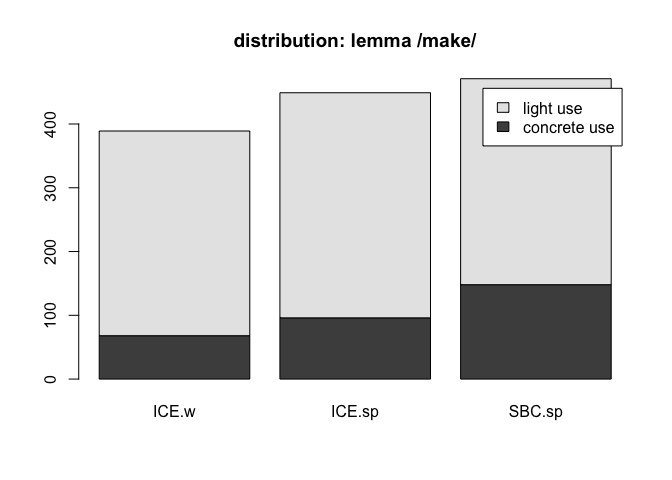
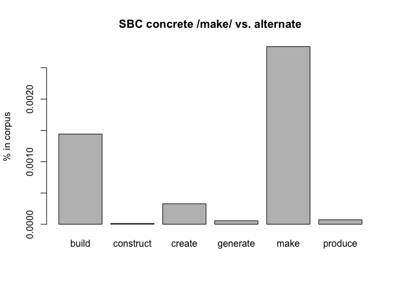

-   [1 term paper draft](#term-paper-draft)
    -   [1.1 init](#init)
    -   [1.2 method](#method)
        -   [1.2.1 corpus sample](#corpus-sample)
        -   [1.2.2 script used:](#script-used)
        -   [1.2.3 process:](#process)
-   [2 B: references](#b-references)

# 1 term paper draft

topic #6, polysemous verbs with light and concrete senses, replication
study of [Mehl (2021)](https://doi.org/10.1515/cllt-2017-0039), further
used: [Gilquin
(2008)](https://dial.uclouvain.be/pr/boreal/object/boreal:75833)

## 1.1 init

“If onomasiological frequency measurements do indeed correlate with
elicitation tests, potential impact would be immense. Researchers would
be able to examine onomasiological frequencies in spoken corpora rather
than performing elicitation tests. That possibility would facilitate
cognitive research into languages and varieties around the world,
without the necessity of in situ psycholinguistic testing, and would
also encourage the creation of more spoken corpora.” ([Mehl (2021)
p.23](https://doi.org/10.1515/cllt-2017-0039))

## 1.2 method

following corpus was used to determine frequencies:

Q.1: Santa Barbara corpus of spoken American English, ([UCSB et al.
(2005)](https://www.linguistics.ucsb.edu/research/santa-barbara-corpus))

the corpus data was downloaded from:
<https://www.linguistics.ucsb.edu/sites/secure.lsit.ucsb.edu.ling.d7/files/sitefiles/research/SBC/SBCorpus.zip>

### 1.2.1 corpus sample

|       | scb |   id | text                                                           |   lfd | light | alt     |
|:----|---:|----:|:-------------------------------------------|----:|----:|:------|
| 15735 |  13 | 1470 | you won’t make half of what I make.                            | 15735 |    NA | make    |
| 11488 |  10 |  369 | .. H .. to make it sound like we’re taking it seriously.       | 11488 |     1 | make    |
| 32736 |  28 | 1019 | H … which like made me think,                                  | 32736 |     1 | make    |
| 13402 |  12 |  180 | H .. We can make generalities.                                 | 13402 |     1 | make    |
| 43953 |  37 |  651 | … I’m just making em short and stubby.                         | 43953 |    NA | make    |
| 58323 |  51 |  302 | I don’t know when my building was built.                       | 58323 |     0 | build   |
| 44301 |  38 |   21 | .. H So they came up here above where the dam was to be built, | 44301 |     0 | build   |
| 24978 |  20 |  763 | .. H even if uh … they’re working about rebuilding old houses, | 24978 |     0 | build   |
| 56378 |  49 |  589 | 2house that Joe built2 .                                       | 56378 |     0 | build   |
| 16947 |  14 |  423 | Oh it’s free-standing building.                                | 16947 |     0 | build   |
| 49997 |  43 | 1404 | so then,                                                       | 49997 |    NA | a-other |
| 56563 |  49 |  774 | 9X9                                                            | 56563 |    NA | a-other |
| 22803 |  18 |  420 | .. Enough to take off.                                         | 22803 |    NA | a-other |
| 50514 |  44 |  424 | SNIFF                                                          | 50514 |    NA | a-other |
| 17783 |  15 |   71 | make connections 2through Mexico2 .                            | 17783 |     1 | make    |
| 44141 |  37 |  839 | … That’s family ~Shane.                                        | 44141 |    NA | a-other |
| 48125 |  42 |  247 | Fucking stupi=d.                                               | 48125 |    NA | a-other |
| 6998  |   6 |  597 | cause they’re the wealthy ones TSK ,                           |  6998 |    NA | a-other |
| 16999 |  14 |  475 | But right now they’re over the forty,                          | 16999 |    NA | a-other |
| 44599 |  38 |  319 | CROWD AND MACHINE NOISE                                        | 44599 |    NA | a-other |

### 1.2.2 script used:

[14015.concrete-abstract_HA.R](14015.concrete-abstract_HA.R)

### 1.2.3 process:

#### 1.2.3.1 distribution analysis

cf. (Mehl 2021, 11–14)

|          | ICE.written | ICE.spoken | SBC.spoken |
|:---------|------------:|-----------:|-----------:|
| concrete |          68 |         96 |         89 |
| light    |         321 |        353 |        381 |

distribution of lemma /make/ over corpora

<figure>

<figcaption aria-hidden="true">distribution of lemma /make/ over
corpora. ICE data from study.</figcaption>
</figure>

#### 1.2.3.2 semantic alternatives to make

| Var1      | Freq |
|:----------|-----:|
| build     |  101 |
| construct |    1 |
| create    |   23 |
| generate  |    4 |
| make      |   89 |
| produce   |    5 |

semantic alternatives

<figure>

<figcaption aria-hidden="true">proportion of semantic alternatives to
concrete /make/ in SBC</figcaption>
</figure>

------------------------------------------------------------------------

# 2 B: references

Gilquin, Gaëtanelle. 2008. “What You Think Ain’t What You Get: Highly
Polysemous Verbs in Mind and Language.”
<https://dial.uclouvain.be/pr/boreal/object/boreal:75833>.

Mehl, Seth. 2021. “What We Talk about When We Talk about Corpus
Frequency: The Example of Polysemous Verbs with Light and Concrete
Senses.” *Corpus Linguistics and Linguistic Theory* 17 (1): 223–47.
<https://doi.org/10.1515/cllt-2017-0039>.

UCSB, John W. DuBois, L. Chafe Wallace, Charles Meyer, Sandra A.
Thompson, Robert Englebretson, and Nii Martey. 2005. “Santa Barbara
Corpus of Spoken American English Department of Linguistics - UC Santa
Barbara.” *SBC*.
<https://www.linguistics.ucsb.edu/research/santa-barbara-corpus>.
