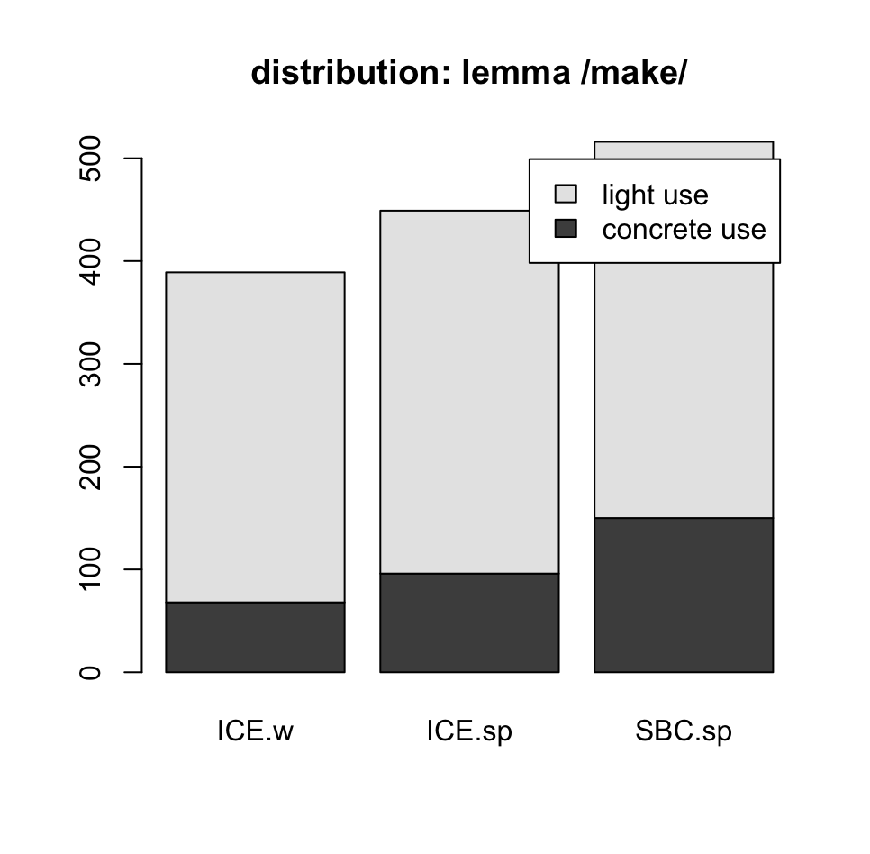

# 14022.spundLX.HA.stefanowitsch
## term paper essai on:
1. "Mehl, S. orcid.org/0000-0003-3036-8132 (2018) What we talk about when we talk about corpus frequency: The example of polysemous verbs with light and concrete senses. Corpus Linguistics and Linguistic Theory. ISSN 1613-7027 [https://doi.org/10.1515/cllt-2017-0039](https://doi.org/10.1515/cllt-2017-0039)"

#### init
"If onomasiological frequency measurements do indeed correlate with elicitation tests, 
potential impact would be immense. Researchers would be able to examine onomasiological frequencies in spoken corpora 
rather than performing elicitation tests. That possibility would facilitate cognitive research into languages and 
varieties around the world, without the necessity of in situ psycholinguistic testing, 
and would also encourage the creation of more spoken corpora." (p.23)

#### method
- used following corpus:   

Q.1: [https://www.linguistics.ucsb.edu/research/santa-barbara-corpus](https://www.linguistics.ucsb.edu/research/santa-barbara-corpus)   
Q.2 "https://www.linguistics.ucsb.edu/sites/secure.lsit.ucsb.edu.ling.d7/files/sitefiles/research/SBC/SBCorpus.zip"

- compare findings and first results:
- instances concrete vs. light

|token|ICE-GB(written)|ICE-GB(spoken)|esteeschwarz: SBC(spoken)|
| ------------ | ------- | ------ | ------ |
|make-concrete|68|96|150|
|make-light|321|353|366|

