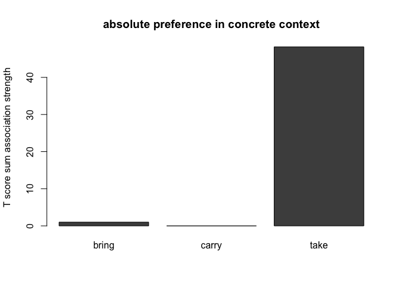

-   [1 term paper draft](#term-paper-draft){#toc-term-paper-draft}
    -   [1.1 init](#init){#toc-init}
    -   [1.2 method](#method){#toc-method}
        -   [1.2.1 corpus sample](#corpus-sample){#toc-corpus-sample}
        -   [1.2.2 script used:](#script-used){#toc-script-used}
        -   [1.2.3 process:](#process){#toc-process}
-   [2 B: references](#b-references){#toc-b-references}

# 1 term paper draft {#term-paper-draft}

topic \#6, polysemous verbs with light and concrete senses, replication study of [Mehl (2021)](https://doi.org/10.1515/cllt-2017-0039), further used [Gilquin (2008)](https://dial.uclouvain.be/pr/boreal/object/boreal:75833)

meta.snc.rmd&gt;md&gt;wp&gt;pkg&gt;toc

## 1.1 init {#init}

“If onomasiological frequency measurements do indeed correlate with elicitation tests, potential impact would be immense. Researchers would be able to examine onomasiological frequencies in spoken corpora rather than performing elicitation tests. That possibility would facilitate cognitive research into languages and varieties around the world, without the necessity of in situ psycholinguistic testing, and would also encourage the creation of more spoken corpora.” ([Mehl (2021) p.23](https://doi.org/10.1515/cllt-2017-0039))

## 1.2 method {#method}

following corpus was used to determine frequencies:

Q.1: Santa Barbara corpus of spoken American English, ([UCSB et al. (2005)](https://www.linguistics.ucsb.edu/research/santa-barbara-corpus))

the corpus data was downloaded from: <https://www.linguistics.ucsb.edu/sites/secure.lsit.ucsb.edu.ling.d7/files/sitefiles/research/SBC/SBCorpus.zip>

### 1.2.1 corpus sample {#corpus-sample}

|       | scb |  id | text                                              |   lfd | light | alt     |
|:-----|----:|----:|:---------------------------------------|-----:|-----:|:-------|
| 2974  |   3 | 242 | % I wanted it to be home made Q .                 |  2974 |     0 | make    |
| 65343 |  57 | 123 | … It’s gonna get messed up.                       | 65343 |    NA | a-other |
| 9465  |   8 | 567 | and then I didn’t and I .. kept making like,      |  9465 |     1 | make    |
| 67928 |  59 | 714 | And he’s really good at making out .. the budget. | 67928 |     1 | make    |
| 35078 |  30 | 612 | … God is continually .. building character.       | 35078 |     0 | build   |
| 61913 |  53 | 604 | and make the payroll,                             | 61913 |     1 | make    |
| 28500 |  24 |  25 | .. Yeah.                                          | 28500 |    NA | a-other |

### 1.2.2 script used: {#script-used}

[14015.concrete-abstract_HA.R](https://github.com/esteeschwarz/SPUND-LX/blob/main/corpusLX/14015-HA/14015.concrete-abstract_HA.R)

### 1.2.3 process: {#process}

#### 1.2.3.1 distribution analysis {#distribution-analysis}

cf. (Mehl 2021, 11–14)

|          | ICE.written | ICE.spoken | SBC.spoken |
|:---------|------------:|-----------:|-----------:|
| concrete |          68 |         96 |         89 |
| light    |         321 |        353 |        381 |

<figure>

<figcaption aria-hidden="true">distribution of lemma /make/ over corpora. ICE data from study.</figcaption>
</figure>

#### 1.2.3.2 semantic alternatives to make {#semantic-alternatives-to-make}

this contrast includes made up alternatives to /make/ that Mehl defined in his study. we do not account for the context of these alternatives in the corpus texts, i.e. all occurences are counted. Mehl contrasted only these alternate occurences which “are defined as those verbs that occur in the corpus with the same concrete direct objects as make, (take, and give,) and with a roughly equivalent meaning.” Mehl puts these under “onomasiological alternates”. (cf. Mehl (2021) p.13)

| Var1      | Freq |
|:----------|-----:|
| build     |  101 |
| construct |    1 |
| create    |   23 |
| generate  |    4 |
| make      |   89 |
| produce   |    5 |

semantic alternatives

<figure>

<figcaption aria-hidden="true">proportion of semantic alternatives to concrete /make/ in SBC</figcaption>
</figure>

<figure>

<figcaption aria-hidden="true">proportion of semantic alternatives, only equivalent meaning of alternates</figcaption>
</figure>

|      | SLOT1     | SLOT2     | fS1 | fS2 | OBS | EXP | ASSOC | COLL.STR.LOGL | SIGNIF     |
|:-----|:---------|:---------|----:|----:|----:|----:|:------|-------------:|:-------|
| 137  | finish    | afghan    |  13 |   2 |   2 |   0 | attr  |      28.51461 | \*\*\*\*\* |
| 654  | Filled    | cookie    |   1 |   6 |   1 |   0 | attr  |      15.81813 | \*\*\*\*   |
| 924  | create    | Adam      |  13 |   1 |   1 |   0 | attr  |      14.17394 | \*\*\*     |
| 928  | create    | rift      |  13 |   1 |   1 |   0 | attr  |      14.17394 | \*\*\*     |
| 930  | record    | Simpsons  |  13 |   1 |   1 |   0 | attr  |      14.17394 | \*\*\*     |
| 1337 | shovel    | food      |   1 |  34 |   1 |   0 | attr  |      12.20185 | \*\*\*     |
| 1338 | Unsweeten | food      |   1 |  34 |   1 |   0 | attr  |      12.20185 | \*\*\*     |
| 1476 | filling   | stuff     |   1 |  46 |   1 |   0 | attr  |      11.58948 | \*\*\*     |
| 1518 | create    | cause     |  13 |   2 |   1 |   0 | attr  |      11.40296 | \*\*\*     |
| 1519 | create    | committee |  13 |   2 |   1 |   0 | attr  |      11.40296 | \*\*\*     |
| 1520 | create    | condition |  13 |   2 |   1 |   0 | attr  |      11.40296 | \*\*\*     |
| 1784 | bake      | bread     |   5 |   7 |   1 |   0 | attr  |      10.48243 | \*\*       |
| 1862 | roll      | tamale    |   8 |   5 |   1 |   0 | attr  |      10.19627 | \*\*       |
| 2626 | record    | trip      |  13 |   8 |   1 |   0 | attr  |       8.15687 | \*\*       |
| 3307 | record    | game      |  13 |  16 |   1 |   0 | attr  |       6.71671 | \*\*       |

<figure>

<figcaption aria-hidden="true">semasiological log.like of near synonymes to make</figcaption>
</figure>

#### 1.2.3.3 2nd approach collexeme evaluation {#nd-approach-collexeme-evaluation}

    ##       head_lemma        lemma light OBS   EXP      T
    ## 18          make        money     1  14 0.084  3.719
    ## 30          make     decision     1  10 0.011  3.159
    ## 31          make   difference     1  10 0.020  3.156
    ## 48          make        sense     1   8 0.017  2.822
    ## 83          make        fudge     0   6 0.003  2.448
    ## 115         make         copy  n.a.   6 0.246  2.349
    ## 144         make          fun     1   5 0.015  2.229
    ## 192         make        thing     1   5 0.318  2.094
    ## 224         make       budget     1   4 0.006  1.997
    ## 235         make       report     1   4 0.010  1.995
    ## 237         make        noise     1   4 0.011  1.994
    ## 265         make         kind     1   4 0.065  1.968
    ## 376         make       tamale     0   3 0.002  1.731
    ## 417         make   connection     1   3 0.008  1.728
    ## 427         make    statement     1   3 0.009  1.727
    ## 446         make       choice     1   3 0.014  1.724
    ## 521         make        point     1   3 0.070  1.692
    ## 531         make         life     1   3 0.081  1.685
    ## 536         make       dollar     1   3 0.085  1.683
    ## 540         make        house     1   3 0.088  1.681
    ## 548         make        horse     1   3 0.102  1.673
    ## 675         make      picture  n.a.   3 0.390  1.507
    ## 807         make    horseshoe     0   2 0.001  1.414
    ## 835         make    cartilage     0   2 0.001  1.414
    ## 868         make         atom     0   2 0.001  1.413
    ## 883         make      ceviche     0   2 0.001  1.413
    ## 891         make     progress     1   2 0.002  1.413
    ## 943         make         gold     0   2 0.002  1.413
    ## 944         make       rubber     0   2 0.002  1.413
    ## 947         make      mistake     1   2 0.002  1.413
    ## 991         make  arrangement     1   2 0.003  1.412
    ## 992         make        pasta     0   2 0.003  1.412
    ## 1015        make      comment     1   2 0.004  1.412
    ## 1045        make   friendship     1   2 0.005  1.411
    ## 1046        make         mess     1   2 0.005  1.411
    ## 1059        make        pizza     0   2 0.005  1.411
    ## 1104        make         clue     1   2 0.007  1.409
    ## 1120        make         turn     1   2 0.008  1.409
    ## 1171        make        judge     1   2 0.011  1.407
    ## 1172        make         mile     1   2 0.011  1.407
    ## 1183        make      seventy     1   2 0.011  1.406
    ## 1197        make         trip     1   2 0.013  1.405
    ## 1244        make       living     1   2 0.017  1.403
    ## 1258        make         mind     1   2 0.017  1.402
    ## 1279        make         deal     1   2 0.019  1.401
    ## 1384        make        water     0   2 0.032  1.391
    ## 1467        make       friend     1   2 0.045  1.382
    ## 1518        make         work     1   2 0.056  1.375
    ## 1552        make            q     1   2 0.066  1.367
    ## 1659        make        sound  n.a.   2 0.101  1.343
    ## 1693        make        thing     0   2 0.116  1.332
    ## 1823        make          lot     1   2 0.172  1.293
    ## 1905        make         year     1   2 0.213  1.264
    ## 1973        make         half  n.a.   3 0.867  1.231
    ## 3533        make  boilerplate     0   1 0.000  1.000
    ## 3534        make        decaf     0   1 0.000  1.000
    ## 3535        make        gravy     0   1 0.000  1.000
    ## 3536        make     leftover     0   1 0.000  1.000
    ## 3537        make         loaf     0   1 0.000  1.000
    ## 3538        make           sw     0   1 0.000  1.000
    ## 3539        make         tart     0   1 0.000  1.000
    ## 4237        make        dingo     0   1 0.001  0.999
    ## 4238        make        quilt     0   1 0.001  0.999
    ## 4239        make      spatula     0   1 0.001  0.999
    ## 4644        make   appearance     1   1 0.001  0.999
    ## 4645        make   assumption     1   1 0.001  0.999
    ## 4646        make        attra     1   1 0.001  0.999
    ## 4647        make         dime     1   1 0.001  0.999
    ## 4648        make    discovery     1   1 0.001  0.999
    ## 4649        make         fuss     1   1 0.001  0.999
    ## 4650        make         gasp     1   1 0.001  0.999
    ## 4651        make   generality     1   1 0.001  0.999
    ## 4652        make  guesstimate     1   1 0.001  0.999
    ## 4653        make        habit     1   1 0.001  0.999
    ## 4654        make   individual     1   1 0.001  0.999
    ## 4655        make intercession     1   1 0.001  0.999
    ## 4656        make      laborer     1   1 0.001  0.999
    ## 4657        make    mandatory     1   1 0.001  0.999
    ## 4658        make       remake     1   1 0.001  0.999
    ## 4659        make      richest     1   1 0.001  0.999
    ## 4660        make       steady     1   1 0.001  0.999
    ## 4661        make     swelling     1   1 0.001  0.999
    ## 4662        make        thous     1   1 0.001  0.999
    ## 4663        make         todo     1   1 0.001  0.999
    ## 4796        make        grape     0   1 0.001  0.999
    ## 5219        make       outfit     0   1 0.001  0.999
    ## 5537        make        kebab     0   1 0.001  0.999
    ## 5538        make        steel     0   1 0.001  0.999
    ## 5691        make       bitter     1   1 0.002  0.998
    ## 5692        make      classic     1   1 0.002  0.998
    ## 5693        make   comparison     1   1 0.002  0.998
    ## 5694        make      fifteen     1   1 0.002  0.998
    ## 5695        make         gods     1   1 0.002  0.998
    ## 5696        make    lakefront     1   1 0.002  0.998
    ## 5697        make         lame     1   1 0.002  0.998
    ## 5698        make          low     1   1 0.002  0.998
    ## 5699        make       motion     1   1 0.002  0.998
    ## 5700        make       nation     1   1 0.002  0.998
    ## 5701        make        races     1   1 0.002  0.998
    ## 5702        make       threat     1   1 0.002  0.998
    ## 5703        make          use     1   1 0.002  0.998
    ## 5832        make       basket     0   1 0.002  0.998
    ## 5833        make       pillow     0   1 0.002  0.998
    ## 6104        make       square     0   1 0.002  0.998
    ## 6344        make     ornament     0   1 0.002  0.998
    ## 6345        make        plate     0   1 0.002  0.998
    ## 6346        make        wiper     0   1 0.002  0.998
    ## 6392        make       Hebrew     1   1 0.002  0.998
    ## 6393        make  measurement     1   1 0.002  0.998
    ## 6394        make       statue     1   1 0.002  0.998
    ## 6395        make       string     1   1 0.002  0.998
    ## 6396        make        teach     1   1 0.002  0.998
    ## 6573        make       market     0   1 0.002  0.998
    ## 6792        make    beginning     0   1 0.003  0.997
    ## 6793        make         loan     0   1 0.003  0.997
    ## 6794        make        sauce     0   1 0.003  0.997
    ## 6981        make          lie     1   1 0.003  0.997
    ## 6982        make     musician     1   1 0.003  0.997
    ## 6983        make    provision     1   1 0.003  0.997
    ## 7151        make        juice     0   1 0.003  0.997
    ## 7152        make         meat     0   1 0.003  0.997
    ## 7272        make         masa     0   1 0.004  0.996
    ## 7374        make    deduction     1   1 0.004  0.996
    ## 7375        make        goody     1   1 0.004  0.996
    ## 7376        make    racetrack     1   1 0.004  0.996
    ## 7377        make        scene     1   1 0.004  0.996
    ## 7378        make    selection     1   1 0.004  0.996
    ## 7430        make          ton     0   1 0.004  0.996
    ## 7534        make      clothes     0   1 0.004  0.996
    ## 7748        make        humor     1   1 0.005  0.995
    ## 7799        make         copy     0   1 0.005  0.995
    ## 7800        make          hay     0   1 0.005  0.995
    ## 7801        make       sister     0   1 0.005  0.995
    ## 7933        make          bed     0   1 0.005  0.995
    ## 7934        make        break     0   1 0.005  0.995
    ## 7935        make         tail     0   1 0.005  0.995
    ## 8035        make        shirt     0   1 0.005  0.995
    ## 8077        make         cent     1   1 0.005  0.995
    ## 8078        make      payroll     1   1 0.005  0.995
    ## 8079        make         ride     1   1 0.005  0.995
    ## 8080        make        sound     1   1 0.005  0.995
    ## 8151        make       cookie     0   1 0.005  0.995
    ## 8270        make        salad     0   1 0.006  0.994
    ## 8340        make        issue     1   1 0.006  0.994
    ## 8341        make     marriage     1   1 0.006  0.994
    ## 8342        make          pan     1   1 0.006  0.994
    ## 8343        make       papers     1   1 0.006  0.994
    ## 8344        make        throw     1   1 0.006  0.994
    ## 8417        make         hair     0   1 0.006  0.994
    ## 8543        make          gay     1   1 0.007  0.993
    ## 8588        make        stone     0   1 0.007  0.993
    ## 8796        make fourthgrader     1   1 0.008  0.992
    ## 8797        make         loan     1   1 0.008  0.992
    ## 8798        make     schedule     1   1 0.008  0.992
    ## 8980        make         call     1   1 0.008  0.992
    ## 9183        make        court     1   1 0.009  0.991
    ## 9184        make          law     1   1 0.009  0.991
    ## 9294        make     tomorrow     0   1 0.009  0.991
    ## 9560        make       center     1   1 0.011  0.989
    ## 9707        make        kinda     1   1 0.011  0.989
    ## 9708        make         note     1   1 0.011  0.989
    ## 9792        make         case     0   1 0.012  0.988
    ## 9793        make       dinner     0   1 0.012  0.988
    ## 9855        make       change     1   1 0.012  0.988
    ## 9856        make          Mrc     1   1 0.012  0.988
    ## 9857        make          tap     1   1 0.012  0.988
    ## 9997        make         buck     1   1 0.013  0.987
    ## 9998        make      fractal     1   1 0.013  0.987
    ## 10091       make        pizza     1   1 0.014  0.986
    ## 10121       make          dad     0   1 0.014  0.986
    ## 10210       make         sign     1   1 0.014  0.986
    ## 10246       make       camper  n.a.   1 0.014  0.986
    ## 10247       make     database  n.a.   1 0.014  0.986
    ## 10248       make          hei  n.a.   1 0.014  0.986
    ## 10249       make         leap  n.a.   1 0.014  0.986
    ## 10816       make         food     0   1 0.019  0.981
    ## 10927       make     concrete     1   1 0.020  0.980
    ## 10928       make         home     1   1 0.020  0.980
    ## 11209       make          eye     1   1 0.023  0.977
    ## 11277       make          dam     1   1 0.024  0.976
    ## 11310       make        today     0   1 0.025  0.975
    ## 11440       make         line     1   1 0.026  0.974
    ## 11441       make        paper     1   1 0.026  0.974
    ## 11596       make      percent     1   1 0.028  0.972
    ## 11605       make        night     0   1 0.028  0.972
    ## 11687       make        dingo  n.a.   1 0.029  0.971
    ## 11689       make           lo  n.a.   1 0.029  0.971
    ## 11691       make         move  n.a.   1 0.029  0.971
    ## 11692       make         noun  n.a.   1 0.029  0.971
    ## 11693       make        quilt  n.a.   1 0.029  0.971
    ## 11713       make        story     1   1 0.029  0.971
    ## 11761       make      balloon     1   1 0.030  0.970
    ## 11771       make        money     0   1 0.030  0.970
    ## 11910       make          man     0   1 0.032  0.968
    ## 12039       make         hour     1   1 0.035  0.965
    ## 12185       make       person     1   1 0.037  0.963
    ## 12233       make        class     1   1 0.038  0.962
    ## 12302       make          job     1   1 0.038  0.962
    ## 12303       make        light     1   1 0.038  0.962
    ## 12529       make         tape     1   1 0.042  0.958
    ## 12579       make        arena  n.a.   1 0.043  0.957
    ## 12580       make  improvement  n.a.   1 0.043  0.957
    ## 12744       make            h     0   1 0.047  0.953
    ## 12886       make            X     1   1 0.051  0.949
    ## 13007       make         foot     1   1 0.054  0.946
    ## 13181       make      regular  n.a.   1 0.058  0.942
    ## 13233       make          car     1   1 0.061  0.939
    ## 13234       make        world     1   1 0.061  0.939
    ## 13769       make          bit     1   1 0.077  0.923
    ## 13825       make       people     0   1 0.079  0.921
    ## 14009       make        humor  n.a.   1 0.087  0.913
    ## 14243       make        block  n.a.   1 0.101  0.899
    ## 14244       make            P  n.a.   1 0.101  0.899
    ## 14245       make     servants  n.a.   1 0.101  0.899
    ## 14452       make          pan  n.a.   1 0.116  0.884
    ## 14453       make         pass  n.a.   1 0.116  0.884
    ## 14481       make         time     0   1 0.118  0.882
    ## 14688       make  application  n.a.   1 0.130  0.870
    ## 14689       make     sandwich  n.a.   1 0.130  0.870
    ## 14690       make            h     1   1 0.130  0.870
    ## 14847       make        stuff     1   1 0.136  0.864
    ## 14928       make     employer  n.a.   1 0.145  0.855
    ## 14929       make        sauce  n.a.   1 0.145  0.855
    ## 14970       make           uh     1   1 0.149  0.851
    ## 15095       make     employee  n.a.   1 0.159  0.841
    ## 15102       make          way     1   1 0.160  0.840
    ## 15228       make            s  n.a.   1 0.173  0.827
    ## 15341       make      section  n.a.   1 0.188  0.812
    ## 15574       make        noise  n.a.   1 0.217  0.783
    ## 15575       make      seventy  n.a.   1 0.217  0.783
    ## 15576       make          sky  n.a.   1 0.217  0.783
    ## 15577       make          Vox  n.a.   1 0.217  0.783
    ## 15744       make        color  n.a.   1 0.246  0.754
    ## 15746       make       recipe  n.a.   1 0.246  0.754
    ## 16139       make         time     1   1 0.325  0.675
    ## 16350       make            f  n.a.   1 0.390  0.610
    ## 17110       make            p  n.a.   1 0.867  0.133
    ## 17190       make         food  n.a.   1 0.998  0.002
    ## 17405       make         life  n.a.   1 1.561 -0.561
    ## 17533       make           uh  n.a.   1 2.863 -1.863
    ## 17543       make          one  n.a.   1 3.181 -2.181
    ## 17566       make         year  n.a.   1 4.092 -3.092

    ##       head_lemma       lemma light OBS   EXP     T
    ## 83          make       fudge     0   6 0.003 2.448
    ## 376         make      tamale     0   3 0.002 1.731
    ## 807         make   horseshoe     0   2 0.001 1.414
    ## 835         make   cartilage     0   2 0.001 1.414
    ## 868         make        atom     0   2 0.001 1.413
    ## 883         make     ceviche     0   2 0.001 1.413
    ## 943         make        gold     0   2 0.002 1.413
    ## 944         make      rubber     0   2 0.002 1.413
    ## 992         make       pasta     0   2 0.003 1.412
    ## 1059        make       pizza     0   2 0.005 1.411
    ## 1384        make       water     0   2 0.032 1.391
    ## 1693        make       thing     0   2 0.116 1.332
    ## 3533        make boilerplate     0   1 0.000 1.000
    ## 3534        make       decaf     0   1 0.000 1.000
    ## 3535        make       gravy     0   1 0.000 1.000
    ## 3536        make    leftover     0   1 0.000 1.000
    ## 3537        make        loaf     0   1 0.000 1.000
    ## 3538        make          sw     0   1 0.000 1.000
    ## 3539        make        tart     0   1 0.000 1.000
    ## 4237        make       dingo     0   1 0.001 0.999
    ## 4238        make       quilt     0   1 0.001 0.999
    ## 4239        make     spatula     0   1 0.001 0.999
    ## 4796        make       grape     0   1 0.001 0.999
    ## 5219        make      outfit     0   1 0.001 0.999
    ## 5537        make       kebab     0   1 0.001 0.999
    ## 5538        make       steel     0   1 0.001 0.999
    ## 5832        make      basket     0   1 0.002 0.998
    ## 5833        make      pillow     0   1 0.002 0.998
    ## 6104        make      square     0   1 0.002 0.998
    ## 6344        make    ornament     0   1 0.002 0.998
    ## 6345        make       plate     0   1 0.002 0.998
    ## 6346        make       wiper     0   1 0.002 0.998
    ## 6573        make      market     0   1 0.002 0.998
    ## 6792        make   beginning     0   1 0.003 0.997
    ## 6793        make        loan     0   1 0.003 0.997
    ## 6794        make       sauce     0   1 0.003 0.997
    ## 7151        make       juice     0   1 0.003 0.997
    ## 7152        make        meat     0   1 0.003 0.997
    ## 7272        make        masa     0   1 0.004 0.996
    ## 7430        make         ton     0   1 0.004 0.996
    ## 7534        make     clothes     0   1 0.004 0.996
    ## 7799        make        copy     0   1 0.005 0.995
    ## 7800        make         hay     0   1 0.005 0.995
    ## 7801        make      sister     0   1 0.005 0.995
    ## 7933        make         bed     0   1 0.005 0.995
    ## 7934        make       break     0   1 0.005 0.995
    ## 7935        make        tail     0   1 0.005 0.995
    ## 8035        make       shirt     0   1 0.005 0.995
    ## 8151        make      cookie     0   1 0.005 0.995
    ## 8270        make       salad     0   1 0.006 0.994
    ## 8417        make        hair     0   1 0.006 0.994
    ## 8588        make       stone     0   1 0.007 0.993
    ## 9294        make    tomorrow     0   1 0.009 0.991
    ## 9792        make        case     0   1 0.012 0.988
    ## 9793        make      dinner     0   1 0.012 0.988
    ## 10121       make         dad     0   1 0.014 0.986
    ## 10816       make        food     0   1 0.019 0.981
    ## 11310       make       today     0   1 0.025 0.975
    ## 11605       make       night     0   1 0.028 0.972
    ## 11771       make       money     0   1 0.030 0.970
    ## 11910       make         man     0   1 0.032 0.968
    ## 12744       make           h     0   1 0.047 0.953
    ## 13825       make      people     0   1 0.079 0.921
    ## 14481       make        time     0   1 0.118 0.882

    ##       head_lemma        lemma light OBS   EXP      T
    ## 18          make        money     1  14 0.084  3.719
    ## 30          make     decision     1  10 0.011  3.159
    ## 31          make   difference     1  10 0.020  3.156
    ## 48          make        sense     1   8 0.017  2.822
    ## 83          make        fudge     0   6 0.003  2.448
    ## 115         make         copy  n.a.   6 0.246  2.349
    ## 144         make          fun     1   5 0.015  2.229
    ## 192         make        thing     1   5 0.318  2.094
    ## 224         make       budget     1   4 0.006  1.997
    ## 235         make       report     1   4 0.010  1.995
    ## 237         make        noise     1   4 0.011  1.994
    ## 265         make         kind     1   4 0.065  1.968
    ## 376         make       tamale     0   3 0.002  1.731
    ## 417         make   connection     1   3 0.008  1.728
    ## 427         make    statement     1   3 0.009  1.727
    ## 446         make       choice     1   3 0.014  1.724
    ## 521         make        point     1   3 0.070  1.692
    ## 531         make         life     1   3 0.081  1.685
    ## 536         make       dollar     1   3 0.085  1.683
    ## 540         make        house     1   3 0.088  1.681
    ## 548         make        horse     1   3 0.102  1.673
    ## 675         make      picture  n.a.   3 0.390  1.507
    ## 807         make    horseshoe     0   2 0.001  1.414
    ## 835         make    cartilage     0   2 0.001  1.414
    ## 868         make         atom     0   2 0.001  1.413
    ## 883         make      ceviche     0   2 0.001  1.413
    ## 891         make     progress     1   2 0.002  1.413
    ## 943         make         gold     0   2 0.002  1.413
    ## 944         make       rubber     0   2 0.002  1.413
    ## 947         make      mistake     1   2 0.002  1.413
    ## 991         make  arrangement     1   2 0.003  1.412
    ## 992         make        pasta     0   2 0.003  1.412
    ## 1015        make      comment     1   2 0.004  1.412
    ## 1045        make   friendship     1   2 0.005  1.411
    ## 1046        make         mess     1   2 0.005  1.411
    ## 1059        make        pizza     0   2 0.005  1.411
    ## 1104        make         clue     1   2 0.007  1.409
    ## 1120        make         turn     1   2 0.008  1.409
    ## 1171        make        judge     1   2 0.011  1.407
    ## 1172        make         mile     1   2 0.011  1.407
    ## 1183        make      seventy     1   2 0.011  1.406
    ## 1197        make         trip     1   2 0.013  1.405
    ## 1244        make       living     1   2 0.017  1.403
    ## 1258        make         mind     1   2 0.017  1.402
    ## 1279        make         deal     1   2 0.019  1.401
    ## 1384        make        water     0   2 0.032  1.391
    ## 1467        make       friend     1   2 0.045  1.382
    ## 1518        make         work     1   2 0.056  1.375
    ## 1552        make            q     1   2 0.066  1.367
    ## 1659        make        sound  n.a.   2 0.101  1.343
    ## 1693        make        thing     0   2 0.116  1.332
    ## 1823        make          lot     1   2 0.172  1.293
    ## 1905        make         year     1   2 0.213  1.264
    ## 1973        make         half  n.a.   3 0.867  1.231
    ## 3533        make  boilerplate     0   1 0.000  1.000
    ## 3534        make        decaf     0   1 0.000  1.000
    ## 3535        make        gravy     0   1 0.000  1.000
    ## 3536        make     leftover     0   1 0.000  1.000
    ## 3537        make         loaf     0   1 0.000  1.000
    ## 3538        make           sw     0   1 0.000  1.000
    ## 3539        make         tart     0   1 0.000  1.000
    ## 4237        make        dingo     0   1 0.001  0.999
    ## 4238        make        quilt     0   1 0.001  0.999
    ## 4239        make      spatula     0   1 0.001  0.999
    ## 4644        make   appearance     1   1 0.001  0.999
    ## 4645        make   assumption     1   1 0.001  0.999
    ## 4646        make        attra     1   1 0.001  0.999
    ## 4647        make         dime     1   1 0.001  0.999
    ## 4648        make    discovery     1   1 0.001  0.999
    ## 4649        make         fuss     1   1 0.001  0.999
    ## 4650        make         gasp     1   1 0.001  0.999
    ## 4651        make   generality     1   1 0.001  0.999
    ## 4652        make  guesstimate     1   1 0.001  0.999
    ## 4653        make        habit     1   1 0.001  0.999
    ## 4654        make   individual     1   1 0.001  0.999
    ## 4655        make intercession     1   1 0.001  0.999
    ## 4656        make      laborer     1   1 0.001  0.999
    ## 4657        make    mandatory     1   1 0.001  0.999
    ## 4658        make       remake     1   1 0.001  0.999
    ## 4659        make      richest     1   1 0.001  0.999
    ## 4660        make       steady     1   1 0.001  0.999
    ## 4661        make     swelling     1   1 0.001  0.999
    ## 4662        make        thous     1   1 0.001  0.999
    ## 4663        make         todo     1   1 0.001  0.999
    ## 4796        make        grape     0   1 0.001  0.999
    ## 5219        make       outfit     0   1 0.001  0.999
    ## 5537        make        kebab     0   1 0.001  0.999
    ## 5538        make        steel     0   1 0.001  0.999
    ## 5691        make       bitter     1   1 0.002  0.998
    ## 5692        make      classic     1   1 0.002  0.998
    ## 5693        make   comparison     1   1 0.002  0.998
    ## 5694        make      fifteen     1   1 0.002  0.998
    ## 5695        make         gods     1   1 0.002  0.998
    ## 5696        make    lakefront     1   1 0.002  0.998
    ## 5697        make         lame     1   1 0.002  0.998
    ## 5698        make          low     1   1 0.002  0.998
    ## 5699        make       motion     1   1 0.002  0.998
    ## 5700        make       nation     1   1 0.002  0.998
    ## 5701        make        races     1   1 0.002  0.998
    ## 5702        make       threat     1   1 0.002  0.998
    ## 5703        make          use     1   1 0.002  0.998
    ## 5832        make       basket     0   1 0.002  0.998
    ## 5833        make       pillow     0   1 0.002  0.998
    ## 6104        make       square     0   1 0.002  0.998
    ## 6344        make     ornament     0   1 0.002  0.998
    ## 6345        make        plate     0   1 0.002  0.998
    ## 6346        make        wiper     0   1 0.002  0.998
    ## 6392        make       Hebrew     1   1 0.002  0.998
    ## 6393        make  measurement     1   1 0.002  0.998
    ## 6394        make       statue     1   1 0.002  0.998
    ## 6395        make       string     1   1 0.002  0.998
    ## 6396        make        teach     1   1 0.002  0.998
    ## 6573        make       market     0   1 0.002  0.998
    ## 6792        make    beginning     0   1 0.003  0.997
    ## 6793        make         loan     0   1 0.003  0.997
    ## 6794        make        sauce     0   1 0.003  0.997
    ## 6981        make          lie     1   1 0.003  0.997
    ## 6982        make     musician     1   1 0.003  0.997
    ## 6983        make    provision     1   1 0.003  0.997
    ## 7151        make        juice     0   1 0.003  0.997
    ## 7152        make         meat     0   1 0.003  0.997
    ## 7272        make         masa     0   1 0.004  0.996
    ## 7374        make    deduction     1   1 0.004  0.996
    ## 7375        make        goody     1   1 0.004  0.996
    ## 7376        make    racetrack     1   1 0.004  0.996
    ## 7377        make        scene     1   1 0.004  0.996
    ## 7378        make    selection     1   1 0.004  0.996
    ## 7430        make          ton     0   1 0.004  0.996
    ## 7534        make      clothes     0   1 0.004  0.996
    ## 7748        make        humor     1   1 0.005  0.995
    ## 7799        make         copy     0   1 0.005  0.995
    ## 7800        make          hay     0   1 0.005  0.995
    ## 7801        make       sister     0   1 0.005  0.995
    ## 7933        make          bed     0   1 0.005  0.995
    ## 7934        make        break     0   1 0.005  0.995
    ## 7935        make         tail     0   1 0.005  0.995
    ## 8035        make        shirt     0   1 0.005  0.995
    ## 8077        make         cent     1   1 0.005  0.995
    ## 8078        make      payroll     1   1 0.005  0.995
    ## 8079        make         ride     1   1 0.005  0.995
    ## 8080        make        sound     1   1 0.005  0.995
    ## 8151        make       cookie     0   1 0.005  0.995
    ## 8270        make        salad     0   1 0.006  0.994
    ## 8340        make        issue     1   1 0.006  0.994
    ## 8341        make     marriage     1   1 0.006  0.994
    ## 8342        make          pan     1   1 0.006  0.994
    ## 8343        make       papers     1   1 0.006  0.994
    ## 8344        make        throw     1   1 0.006  0.994
    ## 8417        make         hair     0   1 0.006  0.994
    ## 8543        make          gay     1   1 0.007  0.993
    ## 8588        make        stone     0   1 0.007  0.993
    ## 8796        make fourthgrader     1   1 0.008  0.992
    ## 8797        make         loan     1   1 0.008  0.992
    ## 8798        make     schedule     1   1 0.008  0.992
    ## 8980        make         call     1   1 0.008  0.992
    ## 9183        make        court     1   1 0.009  0.991
    ## 9184        make          law     1   1 0.009  0.991
    ## 9294        make     tomorrow     0   1 0.009  0.991
    ## 9560        make       center     1   1 0.011  0.989
    ## 9707        make        kinda     1   1 0.011  0.989
    ## 9708        make         note     1   1 0.011  0.989
    ## 9792        make         case     0   1 0.012  0.988
    ## 9793        make       dinner     0   1 0.012  0.988
    ## 9855        make       change     1   1 0.012  0.988
    ## 9856        make          Mrc     1   1 0.012  0.988
    ## 9857        make          tap     1   1 0.012  0.988
    ## 9997        make         buck     1   1 0.013  0.987
    ## 9998        make      fractal     1   1 0.013  0.987
    ## 10091       make        pizza     1   1 0.014  0.986
    ## 10121       make          dad     0   1 0.014  0.986
    ## 10210       make         sign     1   1 0.014  0.986
    ## 10246       make       camper  n.a.   1 0.014  0.986
    ## 10247       make     database  n.a.   1 0.014  0.986
    ## 10248       make          hei  n.a.   1 0.014  0.986
    ## 10249       make         leap  n.a.   1 0.014  0.986
    ## 10816       make         food     0   1 0.019  0.981
    ## 10927       make     concrete     1   1 0.020  0.980
    ## 10928       make         home     1   1 0.020  0.980
    ## 11209       make          eye     1   1 0.023  0.977
    ## 11277       make          dam     1   1 0.024  0.976
    ## 11310       make        today     0   1 0.025  0.975
    ## 11440       make         line     1   1 0.026  0.974
    ## 11441       make        paper     1   1 0.026  0.974
    ## 11596       make      percent     1   1 0.028  0.972
    ## 11605       make        night     0   1 0.028  0.972
    ## 11687       make        dingo  n.a.   1 0.029  0.971
    ## 11689       make           lo  n.a.   1 0.029  0.971
    ## 11691       make         move  n.a.   1 0.029  0.971
    ## 11692       make         noun  n.a.   1 0.029  0.971
    ## 11693       make        quilt  n.a.   1 0.029  0.971
    ## 11713       make        story     1   1 0.029  0.971
    ## 11761       make      balloon     1   1 0.030  0.970
    ## 11771       make        money     0   1 0.030  0.970
    ## 11910       make          man     0   1 0.032  0.968
    ## 12039       make         hour     1   1 0.035  0.965
    ## 12185       make       person     1   1 0.037  0.963
    ## 12233       make        class     1   1 0.038  0.962
    ## 12302       make          job     1   1 0.038  0.962
    ## 12303       make        light     1   1 0.038  0.962
    ## 12529       make         tape     1   1 0.042  0.958
    ## 12579       make        arena  n.a.   1 0.043  0.957
    ## 12580       make  improvement  n.a.   1 0.043  0.957
    ## 12744       make            h     0   1 0.047  0.953
    ## 12886       make            X     1   1 0.051  0.949
    ## 13007       make         foot     1   1 0.054  0.946
    ## 13181       make      regular  n.a.   1 0.058  0.942
    ## 13233       make          car     1   1 0.061  0.939
    ## 13234       make        world     1   1 0.061  0.939
    ## 13769       make          bit     1   1 0.077  0.923
    ## 13825       make       people     0   1 0.079  0.921
    ## 14009       make        humor  n.a.   1 0.087  0.913
    ## 14243       make        block  n.a.   1 0.101  0.899
    ## 14244       make            P  n.a.   1 0.101  0.899
    ## 14245       make     servants  n.a.   1 0.101  0.899
    ## 14452       make          pan  n.a.   1 0.116  0.884
    ## 14453       make         pass  n.a.   1 0.116  0.884
    ## 14481       make         time     0   1 0.118  0.882
    ## 14688       make  application  n.a.   1 0.130  0.870
    ## 14689       make     sandwich  n.a.   1 0.130  0.870
    ## 14690       make            h     1   1 0.130  0.870
    ## 14847       make        stuff     1   1 0.136  0.864
    ## 14928       make     employer  n.a.   1 0.145  0.855
    ## 14929       make        sauce  n.a.   1 0.145  0.855
    ## 14970       make           uh     1   1 0.149  0.851
    ## 15095       make     employee  n.a.   1 0.159  0.841
    ## 15102       make          way     1   1 0.160  0.840
    ## 15228       make            s  n.a.   1 0.173  0.827
    ## 15341       make      section  n.a.   1 0.188  0.812
    ## 15574       make        noise  n.a.   1 0.217  0.783
    ## 15575       make      seventy  n.a.   1 0.217  0.783
    ## 15576       make          sky  n.a.   1 0.217  0.783
    ## 15577       make          Vox  n.a.   1 0.217  0.783
    ## 15744       make        color  n.a.   1 0.246  0.754
    ## 15746       make       recipe  n.a.   1 0.246  0.754
    ## 16139       make         time     1   1 0.325  0.675
    ## 16350       make            f  n.a.   1 0.390  0.610
    ## 17110       make            p  n.a.   1 0.867  0.133
    ## 17190       make         food  n.a.   1 0.998  0.002
    ## 17405       make         life  n.a.   1 1.561 -0.561
    ## 17533       make           uh  n.a.   1 2.863 -1.863
    ## 17543       make          one  n.a.   1 3.181 -2.181
    ## 17566       make         year  n.a.   1 4.092 -3.092

    ##       head_lemma        lemma light OBS   EXP     T
    ## 18          make        money     1  14 0.084 3.719
    ## 30          make     decision     1  10 0.011 3.159
    ## 31          make   difference     1  10 0.020 3.156
    ## 48          make        sense     1   8 0.017 2.822
    ## 144         make          fun     1   5 0.015 2.229
    ## 192         make        thing     1   5 0.318 2.094
    ## 224         make       budget     1   4 0.006 1.997
    ## 235         make       report     1   4 0.010 1.995
    ## 237         make        noise     1   4 0.011 1.994
    ## 265         make         kind     1   4 0.065 1.968
    ## 417         make   connection     1   3 0.008 1.728
    ## 427         make    statement     1   3 0.009 1.727
    ## 446         make       choice     1   3 0.014 1.724
    ## 521         make        point     1   3 0.070 1.692
    ## 531         make         life     1   3 0.081 1.685
    ## 536         make       dollar     1   3 0.085 1.683
    ## 540         make        house     1   3 0.088 1.681
    ## 548         make        horse     1   3 0.102 1.673
    ## 891         make     progress     1   2 0.002 1.413
    ## 947         make      mistake     1   2 0.002 1.413
    ## 991         make  arrangement     1   2 0.003 1.412
    ## 1015        make      comment     1   2 0.004 1.412
    ## 1045        make   friendship     1   2 0.005 1.411
    ## 1046        make         mess     1   2 0.005 1.411
    ## 1104        make         clue     1   2 0.007 1.409
    ## 1120        make         turn     1   2 0.008 1.409
    ## 1171        make        judge     1   2 0.011 1.407
    ## 1172        make         mile     1   2 0.011 1.407
    ## 1183        make      seventy     1   2 0.011 1.406
    ## 1197        make         trip     1   2 0.013 1.405
    ## 1244        make       living     1   2 0.017 1.403
    ## 1258        make         mind     1   2 0.017 1.402
    ## 1279        make         deal     1   2 0.019 1.401
    ## 1467        make       friend     1   2 0.045 1.382
    ## 1518        make         work     1   2 0.056 1.375
    ## 1552        make            q     1   2 0.066 1.367
    ## 1823        make          lot     1   2 0.172 1.293
    ## 1905        make         year     1   2 0.213 1.264
    ## 4644        make   appearance     1   1 0.001 0.999
    ## 4645        make   assumption     1   1 0.001 0.999
    ## 4646        make        attra     1   1 0.001 0.999
    ## 4647        make         dime     1   1 0.001 0.999
    ## 4648        make    discovery     1   1 0.001 0.999
    ## 4649        make         fuss     1   1 0.001 0.999
    ## 4650        make         gasp     1   1 0.001 0.999
    ## 4651        make   generality     1   1 0.001 0.999
    ## 4652        make  guesstimate     1   1 0.001 0.999
    ## 4653        make        habit     1   1 0.001 0.999
    ## 4654        make   individual     1   1 0.001 0.999
    ## 4655        make intercession     1   1 0.001 0.999
    ## 4656        make      laborer     1   1 0.001 0.999
    ## 4657        make    mandatory     1   1 0.001 0.999
    ## 4658        make       remake     1   1 0.001 0.999
    ## 4659        make      richest     1   1 0.001 0.999
    ## 4660        make       steady     1   1 0.001 0.999
    ## 4661        make     swelling     1   1 0.001 0.999
    ## 4662        make        thous     1   1 0.001 0.999
    ## 4663        make         todo     1   1 0.001 0.999
    ## 5691        make       bitter     1   1 0.002 0.998
    ## 5692        make      classic     1   1 0.002 0.998
    ## 5693        make   comparison     1   1 0.002 0.998
    ## 5694        make      fifteen     1   1 0.002 0.998
    ## 5695        make         gods     1   1 0.002 0.998
    ## 5696        make    lakefront     1   1 0.002 0.998
    ## 5697        make         lame     1   1 0.002 0.998
    ## 5698        make          low     1   1 0.002 0.998
    ## 5699        make       motion     1   1 0.002 0.998
    ## 5700        make       nation     1   1 0.002 0.998
    ## 5701        make        races     1   1 0.002 0.998
    ## 5702        make       threat     1   1 0.002 0.998
    ## 5703        make          use     1   1 0.002 0.998
    ## 6392        make       Hebrew     1   1 0.002 0.998
    ## 6393        make  measurement     1   1 0.002 0.998
    ## 6394        make       statue     1   1 0.002 0.998
    ## 6395        make       string     1   1 0.002 0.998
    ## 6396        make        teach     1   1 0.002 0.998
    ## 6981        make          lie     1   1 0.003 0.997
    ## 6982        make     musician     1   1 0.003 0.997
    ## 6983        make    provision     1   1 0.003 0.997
    ## 7374        make    deduction     1   1 0.004 0.996
    ## 7375        make        goody     1   1 0.004 0.996
    ## 7376        make    racetrack     1   1 0.004 0.996
    ## 7377        make        scene     1   1 0.004 0.996
    ## 7378        make    selection     1   1 0.004 0.996
    ## 7748        make        humor     1   1 0.005 0.995
    ## 8077        make         cent     1   1 0.005 0.995
    ## 8078        make      payroll     1   1 0.005 0.995
    ## 8079        make         ride     1   1 0.005 0.995
    ## 8080        make        sound     1   1 0.005 0.995
    ## 8340        make        issue     1   1 0.006 0.994
    ## 8341        make     marriage     1   1 0.006 0.994
    ## 8342        make          pan     1   1 0.006 0.994
    ## 8343        make       papers     1   1 0.006 0.994
    ## 8344        make        throw     1   1 0.006 0.994
    ## 8543        make          gay     1   1 0.007 0.993
    ## 8796        make fourthgrader     1   1 0.008 0.992
    ## 8797        make         loan     1   1 0.008 0.992
    ## 8798        make     schedule     1   1 0.008 0.992
    ## 8980        make         call     1   1 0.008 0.992
    ## 9183        make        court     1   1 0.009 0.991
    ## 9184        make          law     1   1 0.009 0.991
    ## 9560        make       center     1   1 0.011 0.989
    ## 9707        make        kinda     1   1 0.011 0.989
    ## 9708        make         note     1   1 0.011 0.989
    ## 9855        make       change     1   1 0.012 0.988
    ## 9856        make          Mrc     1   1 0.012 0.988
    ## 9857        make          tap     1   1 0.012 0.988
    ## 9997        make         buck     1   1 0.013 0.987
    ## 9998        make      fractal     1   1 0.013 0.987
    ## 10091       make        pizza     1   1 0.014 0.986
    ## 10210       make         sign     1   1 0.014 0.986
    ## 10927       make     concrete     1   1 0.020 0.980
    ## 10928       make         home     1   1 0.020 0.980
    ## 11209       make          eye     1   1 0.023 0.977
    ## 11277       make          dam     1   1 0.024 0.976
    ## 11440       make         line     1   1 0.026 0.974
    ## 11441       make        paper     1   1 0.026 0.974
    ## 11596       make      percent     1   1 0.028 0.972
    ## 11713       make        story     1   1 0.029 0.971
    ## 11761       make      balloon     1   1 0.030 0.970
    ## 12039       make         hour     1   1 0.035 0.965
    ## 12185       make       person     1   1 0.037 0.963
    ## 12233       make        class     1   1 0.038 0.962
    ## 12302       make          job     1   1 0.038 0.962
    ## 12303       make        light     1   1 0.038 0.962
    ## 12529       make         tape     1   1 0.042 0.958
    ## 12886       make            X     1   1 0.051 0.949
    ## 13007       make         foot     1   1 0.054 0.946
    ## 13233       make          car     1   1 0.061 0.939
    ## 13234       make        world     1   1 0.061 0.939
    ## 13769       make          bit     1   1 0.077 0.923
    ## 14690       make            h     1   1 0.130 0.870
    ## 14847       make        stuff     1   1 0.136 0.864
    ## 14970       make           uh     1   1 0.149 0.851
    ## 15102       make          way     1   1 0.160 0.840
    ## 16139       make         time     1   1 0.325 0.675

    ##       head_lemma        lemma light OBS   EXP      T
    ## 18          make        money     1  14 0.084  3.719
    ## 30          make     decision     1  10 0.011  3.159
    ## 31          make   difference     1  10 0.020  3.156
    ## 48          make        sense     1   8 0.017  2.822
    ## 83          make        fudge     0   6 0.003  2.448
    ## 115         make         copy  n.a.   6 0.246  2.349
    ## 144         make          fun     1   5 0.015  2.229
    ## 192         make        thing     1   5 0.318  2.094
    ## 224         make       budget     1   4 0.006  1.997
    ## 235         make       report     1   4 0.010  1.995
    ## 237         make        noise     1   4 0.011  1.994
    ## 265         make         kind     1   4 0.065  1.968
    ## 376         make       tamale     0   3 0.002  1.731
    ## 417         make   connection     1   3 0.008  1.728
    ## 427         make    statement     1   3 0.009  1.727
    ## 446         make       choice     1   3 0.014  1.724
    ## 521         make        point     1   3 0.070  1.692
    ## 531         make         life     1   3 0.081  1.685
    ## 536         make       dollar     1   3 0.085  1.683
    ## 540         make        house     1   3 0.088  1.681
    ## 548         make        horse     1   3 0.102  1.673
    ## 675         make      picture  n.a.   3 0.390  1.507
    ## 807         make    horseshoe     0   2 0.001  1.414
    ## 835         make    cartilage     0   2 0.001  1.414
    ## 868         make         atom     0   2 0.001  1.413
    ## 883         make      ceviche     0   2 0.001  1.413
    ## 891         make     progress     1   2 0.002  1.413
    ## 943         make         gold     0   2 0.002  1.413
    ## 944         make       rubber     0   2 0.002  1.413
    ## 947         make      mistake     1   2 0.002  1.413
    ## 991         make  arrangement     1   2 0.003  1.412
    ## 992         make        pasta     0   2 0.003  1.412
    ## 1015        make      comment     1   2 0.004  1.412
    ## 1045        make   friendship     1   2 0.005  1.411
    ## 1046        make         mess     1   2 0.005  1.411
    ## 1059        make        pizza     0   2 0.005  1.411
    ## 1104        make         clue     1   2 0.007  1.409
    ## 1120        make         turn     1   2 0.008  1.409
    ## 1171        make        judge     1   2 0.011  1.407
    ## 1172        make         mile     1   2 0.011  1.407
    ## 1183        make      seventy     1   2 0.011  1.406
    ## 1197        make         trip     1   2 0.013  1.405
    ## 1244        make       living     1   2 0.017  1.403
    ## 1258        make         mind     1   2 0.017  1.402
    ## 1279        make         deal     1   2 0.019  1.401
    ## 1384        make        water     0   2 0.032  1.391
    ## 1467        make       friend     1   2 0.045  1.382
    ## 1518        make         work     1   2 0.056  1.375
    ## 1552        make            q     1   2 0.066  1.367
    ## 1659        make        sound  n.a.   2 0.101  1.343
    ## 1693        make        thing     0   2 0.116  1.332
    ## 1823        make          lot     1   2 0.172  1.293
    ## 1905        make         year     1   2 0.213  1.264
    ## 1973        make         half  n.a.   3 0.867  1.231
    ## 3533        make  boilerplate     0   1 0.000  1.000
    ## 3534        make        decaf     0   1 0.000  1.000
    ## 3535        make        gravy     0   1 0.000  1.000
    ## 3536        make     leftover     0   1 0.000  1.000
    ## 3537        make         loaf     0   1 0.000  1.000
    ## 3538        make           sw     0   1 0.000  1.000
    ## 3539        make         tart     0   1 0.000  1.000
    ## 4237        make        dingo     0   1 0.001  0.999
    ## 4238        make        quilt     0   1 0.001  0.999
    ## 4239        make      spatula     0   1 0.001  0.999
    ## 4644        make   appearance     1   1 0.001  0.999
    ## 4645        make   assumption     1   1 0.001  0.999
    ## 4646        make        attra     1   1 0.001  0.999
    ## 4647        make         dime     1   1 0.001  0.999
    ## 4648        make    discovery     1   1 0.001  0.999
    ## 4649        make         fuss     1   1 0.001  0.999
    ## 4650        make         gasp     1   1 0.001  0.999
    ## 4651        make   generality     1   1 0.001  0.999
    ## 4652        make  guesstimate     1   1 0.001  0.999
    ## 4653        make        habit     1   1 0.001  0.999
    ## 4654        make   individual     1   1 0.001  0.999
    ## 4655        make intercession     1   1 0.001  0.999
    ## 4656        make      laborer     1   1 0.001  0.999
    ## 4657        make    mandatory     1   1 0.001  0.999
    ## 4658        make       remake     1   1 0.001  0.999
    ## 4659        make      richest     1   1 0.001  0.999
    ## 4660        make       steady     1   1 0.001  0.999
    ## 4661        make     swelling     1   1 0.001  0.999
    ## 4662        make        thous     1   1 0.001  0.999
    ## 4663        make         todo     1   1 0.001  0.999
    ## 4796        make        grape     0   1 0.001  0.999
    ## 5219        make       outfit     0   1 0.001  0.999
    ## 5537        make        kebab     0   1 0.001  0.999
    ## 5538        make        steel     0   1 0.001  0.999
    ## 5691        make       bitter     1   1 0.002  0.998
    ## 5692        make      classic     1   1 0.002  0.998
    ## 5693        make   comparison     1   1 0.002  0.998
    ## 5694        make      fifteen     1   1 0.002  0.998
    ## 5695        make         gods     1   1 0.002  0.998
    ## 5696        make    lakefront     1   1 0.002  0.998
    ## 5697        make         lame     1   1 0.002  0.998
    ## 5698        make          low     1   1 0.002  0.998
    ## 5699        make       motion     1   1 0.002  0.998
    ## 5700        make       nation     1   1 0.002  0.998
    ## 5701        make        races     1   1 0.002  0.998
    ## 5702        make       threat     1   1 0.002  0.998
    ## 5703        make          use     1   1 0.002  0.998
    ## 5832        make       basket     0   1 0.002  0.998
    ## 5833        make       pillow     0   1 0.002  0.998
    ## 6104        make       square     0   1 0.002  0.998
    ## 6344        make     ornament     0   1 0.002  0.998
    ## 6345        make        plate     0   1 0.002  0.998
    ## 6346        make        wiper     0   1 0.002  0.998
    ## 6392        make       Hebrew     1   1 0.002  0.998
    ## 6393        make  measurement     1   1 0.002  0.998
    ## 6394        make       statue     1   1 0.002  0.998
    ## 6395        make       string     1   1 0.002  0.998
    ## 6396        make        teach     1   1 0.002  0.998
    ## 6573        make       market     0   1 0.002  0.998
    ## 6792        make    beginning     0   1 0.003  0.997
    ## 6793        make         loan     0   1 0.003  0.997
    ## 6794        make        sauce     0   1 0.003  0.997
    ## 6981        make          lie     1   1 0.003  0.997
    ## 6982        make     musician     1   1 0.003  0.997
    ## 6983        make    provision     1   1 0.003  0.997
    ## 7151        make        juice     0   1 0.003  0.997
    ## 7152        make         meat     0   1 0.003  0.997
    ## 7272        make         masa     0   1 0.004  0.996
    ## 7374        make    deduction     1   1 0.004  0.996
    ## 7375        make        goody     1   1 0.004  0.996
    ## 7376        make    racetrack     1   1 0.004  0.996
    ## 7377        make        scene     1   1 0.004  0.996
    ## 7378        make    selection     1   1 0.004  0.996
    ## 7430        make          ton     0   1 0.004  0.996
    ## 7534        make      clothes     0   1 0.004  0.996
    ## 7748        make        humor     1   1 0.005  0.995
    ## 7799        make         copy     0   1 0.005  0.995
    ## 7800        make          hay     0   1 0.005  0.995
    ## 7801        make       sister     0   1 0.005  0.995
    ## 7933        make          bed     0   1 0.005  0.995
    ## 7934        make        break     0   1 0.005  0.995
    ## 7935        make         tail     0   1 0.005  0.995
    ## 8035        make        shirt     0   1 0.005  0.995
    ## 8077        make         cent     1   1 0.005  0.995
    ## 8078        make      payroll     1   1 0.005  0.995
    ## 8079        make         ride     1   1 0.005  0.995
    ## 8080        make        sound     1   1 0.005  0.995
    ## 8151        make       cookie     0   1 0.005  0.995
    ## 8270        make        salad     0   1 0.006  0.994
    ## 8340        make        issue     1   1 0.006  0.994
    ## 8341        make     marriage     1   1 0.006  0.994
    ## 8342        make          pan     1   1 0.006  0.994
    ## 8343        make       papers     1   1 0.006  0.994
    ## 8344        make        throw     1   1 0.006  0.994
    ## 8417        make         hair     0   1 0.006  0.994
    ## 8543        make          gay     1   1 0.007  0.993
    ## 8588        make        stone     0   1 0.007  0.993
    ## 8796        make fourthgrader     1   1 0.008  0.992
    ## 8797        make         loan     1   1 0.008  0.992
    ## 8798        make     schedule     1   1 0.008  0.992
    ## 8980        make         call     1   1 0.008  0.992
    ## 9183        make        court     1   1 0.009  0.991
    ## 9184        make          law     1   1 0.009  0.991
    ## 9294        make     tomorrow     0   1 0.009  0.991
    ## 9560        make       center     1   1 0.011  0.989
    ## 9707        make        kinda     1   1 0.011  0.989
    ## 9708        make         note     1   1 0.011  0.989
    ## 9792        make         case     0   1 0.012  0.988
    ## 9793        make       dinner     0   1 0.012  0.988
    ## 9855        make       change     1   1 0.012  0.988
    ## 9856        make          Mrc     1   1 0.012  0.988
    ## 9857        make          tap     1   1 0.012  0.988
    ## 9997        make         buck     1   1 0.013  0.987
    ## 9998        make      fractal     1   1 0.013  0.987
    ## 10091       make        pizza     1   1 0.014  0.986
    ## 10121       make          dad     0   1 0.014  0.986
    ## 10210       make         sign     1   1 0.014  0.986
    ## 10246       make       camper  n.a.   1 0.014  0.986
    ## 10247       make     database  n.a.   1 0.014  0.986
    ## 10248       make          hei  n.a.   1 0.014  0.986
    ## 10249       make         leap  n.a.   1 0.014  0.986
    ## 10816       make         food     0   1 0.019  0.981
    ## 10927       make     concrete     1   1 0.020  0.980
    ## 10928       make         home     1   1 0.020  0.980
    ## 11209       make          eye     1   1 0.023  0.977
    ## 11277       make          dam     1   1 0.024  0.976
    ## 11310       make        today     0   1 0.025  0.975
    ## 11440       make         line     1   1 0.026  0.974
    ## 11441       make        paper     1   1 0.026  0.974
    ## 11596       make      percent     1   1 0.028  0.972
    ## 11605       make        night     0   1 0.028  0.972
    ## 11687       make        dingo  n.a.   1 0.029  0.971
    ## 11689       make           lo  n.a.   1 0.029  0.971
    ## 11691       make         move  n.a.   1 0.029  0.971
    ## 11692       make         noun  n.a.   1 0.029  0.971
    ## 11693       make        quilt  n.a.   1 0.029  0.971
    ## 11713       make        story     1   1 0.029  0.971
    ## 11761       make      balloon     1   1 0.030  0.970
    ## 11771       make        money     0   1 0.030  0.970
    ## 11910       make          man     0   1 0.032  0.968
    ## 12039       make         hour     1   1 0.035  0.965
    ## 12185       make       person     1   1 0.037  0.963
    ## 12233       make        class     1   1 0.038  0.962
    ## 12302       make          job     1   1 0.038  0.962
    ## 12303       make        light     1   1 0.038  0.962
    ## 12529       make         tape     1   1 0.042  0.958
    ## 12579       make        arena  n.a.   1 0.043  0.957
    ## 12580       make  improvement  n.a.   1 0.043  0.957
    ## 12744       make            h     0   1 0.047  0.953
    ## 12886       make            X     1   1 0.051  0.949
    ## 13007       make         foot     1   1 0.054  0.946
    ## 13181       make      regular  n.a.   1 0.058  0.942
    ## 13233       make          car     1   1 0.061  0.939
    ## 13234       make        world     1   1 0.061  0.939
    ## 13769       make          bit     1   1 0.077  0.923
    ## 13825       make       people     0   1 0.079  0.921
    ## 14009       make        humor  n.a.   1 0.087  0.913
    ## 14243       make        block  n.a.   1 0.101  0.899
    ## 14244       make            P  n.a.   1 0.101  0.899
    ## 14245       make     servants  n.a.   1 0.101  0.899
    ## 14452       make          pan  n.a.   1 0.116  0.884
    ## 14453       make         pass  n.a.   1 0.116  0.884
    ## 14481       make         time     0   1 0.118  0.882
    ## 14688       make  application  n.a.   1 0.130  0.870
    ## 14689       make     sandwich  n.a.   1 0.130  0.870
    ## 14690       make            h     1   1 0.130  0.870
    ## 14847       make        stuff     1   1 0.136  0.864
    ## 14928       make     employer  n.a.   1 0.145  0.855
    ## 14929       make        sauce  n.a.   1 0.145  0.855
    ## 14970       make           uh     1   1 0.149  0.851
    ## 15095       make     employee  n.a.   1 0.159  0.841
    ## 15102       make          way     1   1 0.160  0.840
    ## 15228       make            s  n.a.   1 0.173  0.827
    ## 15341       make      section  n.a.   1 0.188  0.812
    ## 15574       make        noise  n.a.   1 0.217  0.783
    ## 15575       make      seventy  n.a.   1 0.217  0.783
    ## 15576       make          sky  n.a.   1 0.217  0.783
    ## 15577       make          Vox  n.a.   1 0.217  0.783
    ## 15744       make        color  n.a.   1 0.246  0.754
    ## 15746       make       recipe  n.a.   1 0.246  0.754
    ## 16139       make         time     1   1 0.325  0.675
    ## 16350       make            f  n.a.   1 0.390  0.610
    ## 17110       make            p  n.a.   1 0.867  0.133
    ## 17190       make         food  n.a.   1 0.998  0.002
    ## 17405       make         life  n.a.   1 1.561 -0.561
    ## 17533       make           uh  n.a.   1 2.863 -1.863
    ## 17543       make          one  n.a.   1 3.181 -2.181
    ## 17566       make         year  n.a.   1 4.092 -3.092

    ##       head_lemma        lemma light OBS   EXP      T
    ## 18          make        money     1  14 0.084  3.719
    ## 30          make     decision     1  10 0.011  3.159
    ## 31          make   difference     1  10 0.020  3.156
    ## 48          make        sense     1   8 0.017  2.822
    ## 83          make        fudge     0   6 0.003  2.448
    ## 115         make         copy  n.a.   6 0.246  2.349
    ## 144         make          fun     1   5 0.015  2.229
    ## 192         make        thing     1   5 0.318  2.094
    ## 224         make       budget     1   4 0.006  1.997
    ## 235         make       report     1   4 0.010  1.995
    ## 237         make        noise     1   4 0.011  1.994
    ## 265         make         kind     1   4 0.065  1.968
    ## 376         make       tamale     0   3 0.002  1.731
    ## 417         make   connection     1   3 0.008  1.728
    ## 427         make    statement     1   3 0.009  1.727
    ## 446         make       choice     1   3 0.014  1.724
    ## 521         make        point     1   3 0.070  1.692
    ## 531         make         life     1   3 0.081  1.685
    ## 536         make       dollar     1   3 0.085  1.683
    ## 540         make        house     1   3 0.088  1.681
    ## 548         make        horse     1   3 0.102  1.673
    ## 675         make      picture  n.a.   3 0.390  1.507
    ## 807         make    horseshoe     0   2 0.001  1.414
    ## 835         make    cartilage     0   2 0.001  1.414
    ## 868         make         atom     0   2 0.001  1.413
    ## 883         make      ceviche     0   2 0.001  1.413
    ## 891         make     progress     1   2 0.002  1.413
    ## 943         make         gold     0   2 0.002  1.413
    ## 944         make       rubber     0   2 0.002  1.413
    ## 947         make      mistake     1   2 0.002  1.413
    ## 991         make  arrangement     1   2 0.003  1.412
    ## 992         make        pasta     0   2 0.003  1.412
    ## 1015        make      comment     1   2 0.004  1.412
    ## 1045        make   friendship     1   2 0.005  1.411
    ## 1046        make         mess     1   2 0.005  1.411
    ## 1059        make        pizza     0   2 0.005  1.411
    ## 1104        make         clue     1   2 0.007  1.409
    ## 1120        make         turn     1   2 0.008  1.409
    ## 1171        make        judge     1   2 0.011  1.407
    ## 1172        make         mile     1   2 0.011  1.407
    ## 1183        make      seventy     1   2 0.011  1.406
    ## 1197        make         trip     1   2 0.013  1.405
    ## 1244        make       living     1   2 0.017  1.403
    ## 1258        make         mind     1   2 0.017  1.402
    ## 1279        make         deal     1   2 0.019  1.401
    ## 1384        make        water     0   2 0.032  1.391
    ## 1467        make       friend     1   2 0.045  1.382
    ## 1518        make         work     1   2 0.056  1.375
    ## 1552        make            q     1   2 0.066  1.367
    ## 1659        make        sound  n.a.   2 0.101  1.343
    ## 1693        make        thing     0   2 0.116  1.332
    ## 1823        make          lot     1   2 0.172  1.293
    ## 1905        make         year     1   2 0.213  1.264
    ## 1973        make         half  n.a.   3 0.867  1.231
    ## 3533        make  boilerplate     0   1 0.000  1.000
    ## 3534        make        decaf     0   1 0.000  1.000
    ## 3535        make        gravy     0   1 0.000  1.000
    ## 3536        make     leftover     0   1 0.000  1.000
    ## 3537        make         loaf     0   1 0.000  1.000
    ## 3538        make           sw     0   1 0.000  1.000
    ## 3539        make         tart     0   1 0.000  1.000
    ## 4237        make        dingo     0   1 0.001  0.999
    ## 4238        make        quilt     0   1 0.001  0.999
    ## 4239        make      spatula     0   1 0.001  0.999
    ## 4644        make   appearance     1   1 0.001  0.999
    ## 4645        make   assumption     1   1 0.001  0.999
    ## 4646        make        attra     1   1 0.001  0.999
    ## 4647        make         dime     1   1 0.001  0.999
    ## 4648        make    discovery     1   1 0.001  0.999
    ## 4649        make         fuss     1   1 0.001  0.999
    ## 4650        make         gasp     1   1 0.001  0.999
    ## 4651        make   generality     1   1 0.001  0.999
    ## 4652        make  guesstimate     1   1 0.001  0.999
    ## 4653        make        habit     1   1 0.001  0.999
    ## 4654        make   individual     1   1 0.001  0.999
    ## 4655        make intercession     1   1 0.001  0.999
    ## 4656        make      laborer     1   1 0.001  0.999
    ## 4657        make    mandatory     1   1 0.001  0.999
    ## 4658        make       remake     1   1 0.001  0.999
    ## 4659        make      richest     1   1 0.001  0.999
    ## 4660        make       steady     1   1 0.001  0.999
    ## 4661        make     swelling     1   1 0.001  0.999
    ## 4662        make        thous     1   1 0.001  0.999
    ## 4663        make         todo     1   1 0.001  0.999
    ## 4796        make        grape     0   1 0.001  0.999
    ## 5219        make       outfit     0   1 0.001  0.999
    ## 5537        make        kebab     0   1 0.001  0.999
    ## 5538        make        steel     0   1 0.001  0.999
    ## 5691        make       bitter     1   1 0.002  0.998
    ## 5692        make      classic     1   1 0.002  0.998
    ## 5693        make   comparison     1   1 0.002  0.998
    ## 5694        make      fifteen     1   1 0.002  0.998
    ## 5695        make         gods     1   1 0.002  0.998
    ## 5696        make    lakefront     1   1 0.002  0.998
    ## 5697        make         lame     1   1 0.002  0.998
    ## 5698        make          low     1   1 0.002  0.998
    ## 5699        make       motion     1   1 0.002  0.998
    ## 5700        make       nation     1   1 0.002  0.998
    ## 5701        make        races     1   1 0.002  0.998
    ## 5702        make       threat     1   1 0.002  0.998
    ## 5703        make          use     1   1 0.002  0.998
    ## 5832        make       basket     0   1 0.002  0.998
    ## 5833        make       pillow     0   1 0.002  0.998
    ## 6104        make       square     0   1 0.002  0.998
    ## 6344        make     ornament     0   1 0.002  0.998
    ## 6345        make        plate     0   1 0.002  0.998
    ## 6346        make        wiper     0   1 0.002  0.998
    ## 6392        make       Hebrew     1   1 0.002  0.998
    ## 6393        make  measurement     1   1 0.002  0.998
    ## 6394        make       statue     1   1 0.002  0.998
    ## 6395        make       string     1   1 0.002  0.998
    ## 6396        make        teach     1   1 0.002  0.998
    ## 6573        make       market     0   1 0.002  0.998
    ## 6792        make    beginning     0   1 0.003  0.997
    ## 6793        make         loan     0   1 0.003  0.997
    ## 6794        make        sauce     0   1 0.003  0.997
    ## 6981        make          lie     1   1 0.003  0.997
    ## 6982        make     musician     1   1 0.003  0.997
    ## 6983        make    provision     1   1 0.003  0.997
    ## 7151        make        juice     0   1 0.003  0.997
    ## 7152        make         meat     0   1 0.003  0.997
    ## 7272        make         masa     0   1 0.004  0.996
    ## 7374        make    deduction     1   1 0.004  0.996
    ## 7375        make        goody     1   1 0.004  0.996
    ## 7376        make    racetrack     1   1 0.004  0.996
    ## 7377        make        scene     1   1 0.004  0.996
    ## 7378        make    selection     1   1 0.004  0.996
    ## 7430        make          ton     0   1 0.004  0.996
    ## 7534        make      clothes     0   1 0.004  0.996
    ## 7748        make        humor     1   1 0.005  0.995
    ## 7799        make         copy     0   1 0.005  0.995
    ## 7800        make          hay     0   1 0.005  0.995
    ## 7801        make       sister     0   1 0.005  0.995
    ## 7933        make          bed     0   1 0.005  0.995
    ## 7934        make        break     0   1 0.005  0.995
    ## 7935        make         tail     0   1 0.005  0.995
    ## 8035        make        shirt     0   1 0.005  0.995
    ## 8077        make         cent     1   1 0.005  0.995
    ## 8078        make      payroll     1   1 0.005  0.995
    ## 8079        make         ride     1   1 0.005  0.995
    ## 8080        make        sound     1   1 0.005  0.995
    ## 8151        make       cookie     0   1 0.005  0.995
    ## 8270        make        salad     0   1 0.006  0.994
    ## 8340        make        issue     1   1 0.006  0.994
    ## 8341        make     marriage     1   1 0.006  0.994
    ## 8342        make          pan     1   1 0.006  0.994
    ## 8343        make       papers     1   1 0.006  0.994
    ## 8344        make        throw     1   1 0.006  0.994
    ## 8417        make         hair     0   1 0.006  0.994
    ## 8543        make          gay     1   1 0.007  0.993
    ## 8588        make        stone     0   1 0.007  0.993
    ## 8796        make fourthgrader     1   1 0.008  0.992
    ## 8797        make         loan     1   1 0.008  0.992
    ## 8798        make     schedule     1   1 0.008  0.992
    ## 8980        make         call     1   1 0.008  0.992
    ## 9183        make        court     1   1 0.009  0.991
    ## 9184        make          law     1   1 0.009  0.991
    ## 9294        make     tomorrow     0   1 0.009  0.991
    ## 9560        make       center     1   1 0.011  0.989
    ## 9707        make        kinda     1   1 0.011  0.989
    ## 9708        make         note     1   1 0.011  0.989
    ## 9792        make         case     0   1 0.012  0.988
    ## 9793        make       dinner     0   1 0.012  0.988
    ## 9855        make       change     1   1 0.012  0.988
    ## 9856        make          Mrc     1   1 0.012  0.988
    ## 9857        make          tap     1   1 0.012  0.988
    ## 9997        make         buck     1   1 0.013  0.987
    ## 9998        make      fractal     1   1 0.013  0.987
    ## 10091       make        pizza     1   1 0.014  0.986
    ## 10121       make          dad     0   1 0.014  0.986
    ## 10210       make         sign     1   1 0.014  0.986
    ## 10246       make       camper  n.a.   1 0.014  0.986
    ## 10247       make     database  n.a.   1 0.014  0.986
    ## 10248       make          hei  n.a.   1 0.014  0.986
    ## 10249       make         leap  n.a.   1 0.014  0.986
    ## 10816       make         food     0   1 0.019  0.981
    ## 10927       make     concrete     1   1 0.020  0.980
    ## 10928       make         home     1   1 0.020  0.980
    ## 11209       make          eye     1   1 0.023  0.977
    ## 11277       make          dam     1   1 0.024  0.976
    ## 11310       make        today     0   1 0.025  0.975
    ## 11440       make         line     1   1 0.026  0.974
    ## 11441       make        paper     1   1 0.026  0.974
    ## 11596       make      percent     1   1 0.028  0.972
    ## 11605       make        night     0   1 0.028  0.972
    ## 11687       make        dingo  n.a.   1 0.029  0.971
    ## 11689       make           lo  n.a.   1 0.029  0.971
    ## 11691       make         move  n.a.   1 0.029  0.971
    ## 11692       make         noun  n.a.   1 0.029  0.971
    ## 11693       make        quilt  n.a.   1 0.029  0.971
    ## 11713       make        story     1   1 0.029  0.971
    ## 11761       make      balloon     1   1 0.030  0.970
    ## 11771       make        money     0   1 0.030  0.970
    ## 11910       make          man     0   1 0.032  0.968
    ## 12039       make         hour     1   1 0.035  0.965
    ## 12185       make       person     1   1 0.037  0.963
    ## 12233       make        class     1   1 0.038  0.962
    ## 12302       make          job     1   1 0.038  0.962
    ## 12303       make        light     1   1 0.038  0.962
    ## 12529       make         tape     1   1 0.042  0.958
    ## 12579       make        arena  n.a.   1 0.043  0.957
    ## 12580       make  improvement  n.a.   1 0.043  0.957
    ## 12744       make            h     0   1 0.047  0.953
    ## 12886       make            X     1   1 0.051  0.949
    ## 13007       make         foot     1   1 0.054  0.946
    ## 13181       make      regular  n.a.   1 0.058  0.942
    ## 13233       make          car     1   1 0.061  0.939
    ## 13234       make        world     1   1 0.061  0.939
    ## 13769       make          bit     1   1 0.077  0.923
    ## 13825       make       people     0   1 0.079  0.921
    ## 14009       make        humor  n.a.   1 0.087  0.913
    ## 14243       make        block  n.a.   1 0.101  0.899
    ## 14244       make            P  n.a.   1 0.101  0.899
    ## 14245       make     servants  n.a.   1 0.101  0.899
    ## 14452       make          pan  n.a.   1 0.116  0.884
    ## 14453       make         pass  n.a.   1 0.116  0.884
    ## 14481       make         time     0   1 0.118  0.882
    ## 14688       make  application  n.a.   1 0.130  0.870
    ## 14689       make     sandwich  n.a.   1 0.130  0.870
    ## 14690       make            h     1   1 0.130  0.870
    ## 14847       make        stuff     1   1 0.136  0.864
    ## 14928       make     employer  n.a.   1 0.145  0.855
    ## 14929       make        sauce  n.a.   1 0.145  0.855
    ## 14970       make           uh     1   1 0.149  0.851
    ## 15095       make     employee  n.a.   1 0.159  0.841
    ## 15102       make          way     1   1 0.160  0.840
    ## 15228       make            s  n.a.   1 0.173  0.827
    ## 15341       make      section  n.a.   1 0.188  0.812
    ## 15574       make        noise  n.a.   1 0.217  0.783
    ## 15575       make      seventy  n.a.   1 0.217  0.783
    ## 15576       make          sky  n.a.   1 0.217  0.783
    ## 15577       make          Vox  n.a.   1 0.217  0.783
    ## 15744       make        color  n.a.   1 0.246  0.754
    ## 15746       make       recipe  n.a.   1 0.246  0.754
    ## 16139       make         time     1   1 0.325  0.675
    ## 16350       make            f  n.a.   1 0.390  0.610
    ## 17110       make            p  n.a.   1 0.867  0.133
    ## 17190       make         food  n.a.   1 0.998  0.002
    ## 17405       make         life  n.a.   1 1.561 -0.561
    ## 17533       make           uh  n.a.   1 2.863 -1.863
    ## 17543       make          one  n.a.   1 3.181 -2.181
    ## 17566       make         year  n.a.   1 4.092 -3.092

    ##       head_lemma       lemma light OBS   EXP     T
    ## 83          make       fudge     0   6 0.003 2.448
    ## 376         make      tamale     0   3 0.002 1.731
    ## 807         make   horseshoe     0   2 0.001 1.414
    ## 835         make   cartilage     0   2 0.001 1.414
    ## 868         make        atom     0   2 0.001 1.413
    ## 883         make     ceviche     0   2 0.001 1.413
    ## 943         make        gold     0   2 0.002 1.413
    ## 944         make      rubber     0   2 0.002 1.413
    ## 992         make       pasta     0   2 0.003 1.412
    ## 1059        make       pizza     0   2 0.005 1.411
    ## 1384        make       water     0   2 0.032 1.391
    ## 1693        make       thing     0   2 0.116 1.332
    ## 3533        make boilerplate     0   1 0.000 1.000
    ## 3534        make       decaf     0   1 0.000 1.000
    ## 3535        make       gravy     0   1 0.000 1.000
    ## 3536        make    leftover     0   1 0.000 1.000
    ## 3537        make        loaf     0   1 0.000 1.000
    ## 3538        make          sw     0   1 0.000 1.000
    ## 3539        make        tart     0   1 0.000 1.000
    ## 4237        make       dingo     0   1 0.001 0.999
    ## 4238        make       quilt     0   1 0.001 0.999
    ## 4239        make     spatula     0   1 0.001 0.999
    ## 4796        make       grape     0   1 0.001 0.999
    ## 5219        make      outfit     0   1 0.001 0.999
    ## 5537        make       kebab     0   1 0.001 0.999
    ## 5538        make       steel     0   1 0.001 0.999
    ## 5832        make      basket     0   1 0.002 0.998
    ## 5833        make      pillow     0   1 0.002 0.998
    ## 6104        make      square     0   1 0.002 0.998
    ## 6344        make    ornament     0   1 0.002 0.998
    ## 6345        make       plate     0   1 0.002 0.998
    ## 6346        make       wiper     0   1 0.002 0.998
    ## 6573        make      market     0   1 0.002 0.998
    ## 6792        make   beginning     0   1 0.003 0.997
    ## 6793        make        loan     0   1 0.003 0.997
    ## 6794        make       sauce     0   1 0.003 0.997
    ## 7151        make       juice     0   1 0.003 0.997
    ## 7152        make        meat     0   1 0.003 0.997
    ## 7272        make        masa     0   1 0.004 0.996
    ## 7430        make         ton     0   1 0.004 0.996
    ## 7534        make     clothes     0   1 0.004 0.996
    ## 7799        make        copy     0   1 0.005 0.995
    ## 7800        make         hay     0   1 0.005 0.995
    ## 7801        make      sister     0   1 0.005 0.995
    ## 7933        make         bed     0   1 0.005 0.995
    ## 7934        make       break     0   1 0.005 0.995
    ## 7935        make        tail     0   1 0.005 0.995
    ## 8035        make       shirt     0   1 0.005 0.995
    ## 8151        make      cookie     0   1 0.005 0.995
    ## 8270        make       salad     0   1 0.006 0.994
    ## 8417        make        hair     0   1 0.006 0.994
    ## 8588        make       stone     0   1 0.007 0.993
    ## 9294        make    tomorrow     0   1 0.009 0.991
    ## 9792        make        case     0   1 0.012 0.988
    ## 9793        make      dinner     0   1 0.012 0.988
    ## 10121       make         dad     0   1 0.014 0.986
    ## 10816       make        food     0   1 0.019 0.981
    ## 11310       make       today     0   1 0.025 0.975
    ## 11605       make       night     0   1 0.028 0.972
    ## 11771       make       money     0   1 0.030 0.970
    ## 11910       make         man     0   1 0.032 0.968
    ## 12744       make           h     0   1 0.047 0.953
    ## 13825       make      people     0   1 0.079 0.921
    ## 14481       make        time     0   1 0.118 0.882

<figure>

<figcaption aria-hidden="true">semasiological: sum T-score of near synonymes to make</figcaption>
</figure>

<figure>

<figcaption aria-hidden="true">semasiological: sum T-score of near synonymes to take</figcaption>
</figure>

<figure>

<figcaption aria-hidden="true">semasiological: p of near synonymes to make</figcaption>
</figure>

<figure>

<figcaption aria-hidden="true">semasiological: p of near synonymes to take</figcaption>
</figure>

------------------------------------------------------------------------

# 2 B: references {#b-references .unnumbered}

Gilquin, Gaëtanelle. 2008. “What You Think Ain’t What You Get: Highly Polysemous Verbs in Mind and Language.” <https://dial.uclouvain.be/pr/boreal/object/boreal:75833>.

Mehl, Seth. 2021. “What We Talk about When We Talk about Corpus Frequency: The Example of Polysemous Verbs with Light and Concrete Senses.” *Corpus Linguistics and Linguistic Theory* 17 (1): 223–47. <https://doi.org/10.1515/cllt-2017-0039>.

UCSB, John W. DuBois, L. Chafe Wallace, Charles Meyer, Sandra A. Thompson, Robert Englebretson, and Nii Martey. 2005. “Santa Barbara Corpus of Spoken American English Department of Linguistics - UC Santa Barbara.” *SBC*. <https://www.linguistics.ucsb.edu/research/santa-barbara-corpus>.

