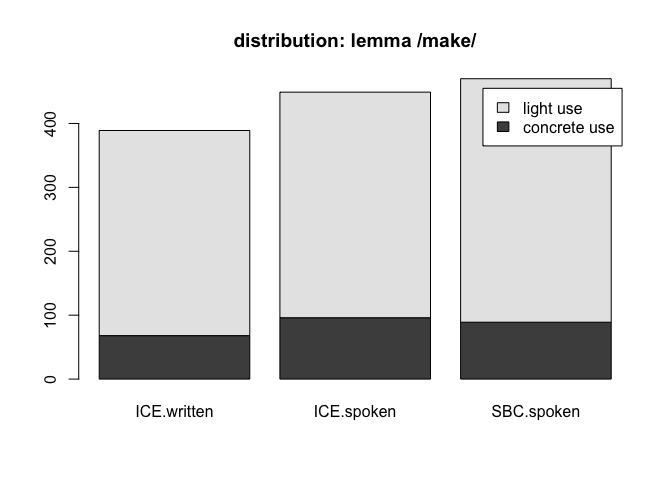

-   [1 term paper draft](#term-paper-draft)
    -   [1.1 init](#init)
    -   [1.2 method](#method)
        -   [1.2.1 corpus sample](#corpus-sample)
        -   [1.2.2 script used:](#script-used)
        -   [1.2.3 process:](#process)
-   [2 B: references](#b-references)

# 1 term paper draft

topic #6, polysemous verbs with light and concrete senses, replication
study of [Mehl (2021)](https://doi.org/10.1515/cllt-2017-0039), further
used: [Gilquin
(2008)](https://dial.uclouvain.be/pr/boreal/object/boreal:75833)

## 1.1 init

“If onomasiological frequency measurements do indeed correlate with
elicitation tests, potential impact would be immense. Researchers would
be able to examine onomasiological frequencies in spoken corpora rather
than performing elicitation tests. That possibility would facilitate
cognitive research into languages and varieties around the world,
without the necessity of in situ psycholinguistic testing, and would
also encourage the creation of more spoken corpora.” ([Mehl (2021)
p.23](https://doi.org/10.1515/cllt-2017-0039))

## 1.2 method

following corpus was used to determine frequencies:

Q.1: Santa Barbara corpus of spoken American English, ([UCSB et al.
(2005)](https://www.linguistics.ucsb.edu/research/santa-barbara-corpus))

the corpus data was downloaded from:
<https://www.linguistics.ucsb.edu/sites/secure.lsit.ucsb.edu.ling.d7/files/sitefiles/research/SBC/SBCorpus.zip>

### 1.2.1 corpus sample

|       | scb |   id | text                                                             |   lfd | light | alt     |
|:----|---:|----:|:------------------------------------------|----:|----:|:------|
| 23238 |  19 |  289 | .. who makes his living,                                         | 23238 |     1 | make    |
| 23878 |  19 |  929 | How are you gonna make the strings.                              | 23878 |     1 | make    |
| 15912 |  13 | 1647 | It makes me too cold.                                            | 15912 |     1 | make    |
| 46915 |  41 |   30 | H first of all we make a good guesstimate.                       | 46915 |     1 | make    |
| 6661  |   6 |  260 | It sounds like the tape I made last night,                       |  6661 |     0 | make    |
| 12496 |  11 |  270 | .. % needs a larger building.                                    | 12496 |     0 | build   |
| 44867 |  38 |  587 | H the top deck of that building will be an observation platform, | 44867 |     0 | build   |
| 21402 |  17 |  188 | And you’re building on the thoughts of th- your predecessors,    | 21402 |     0 | build   |
| 18118 |  15 |  406 | it’s built during the –                                          | 18118 |     0 | build   |
| 37784 |  32 | 1034 | we found he’d built the fence.                                   | 37784 |     0 | build   |
| 55435 |  48 |  774 | you know,                                                        | 55435 |    NA | a-other |
| 23198 |  19 |  249 | Hx                                                               | 23198 |    NA | a-other |
| 29469 |  25 |  119 | .. When he will,                                                 | 29469 |    NA | a-other |
| 34238 |  29 |  986 | SNIFF .. Sure .                                                  | 34238 |    NA | a-other |
| 9604  |   8 |  706 | .. but when uh uh=,                                              |  9604 |    NA | a-other |
| 25411 |  21 |  356 | I don’t know.                                                    | 25411 |    NA | a-other |
| 40061 |  34 |  650 | … She said things to me today.                                   | 40061 |    NA | a-other |
| 59586 |  51 | 1565 | Four years.                                                      | 59586 |    NA | a-other |
| 53610 |  47 |  111 | That’s the last thing you wanted to hear.                        | 53610 |    NA | a-other |
| 24160 |  19 | 1211 | NA                                                               | 24160 |    NA | a-other |

### 1.2.2 script used:

[14015.concrete-abstract_HA.R](14015.concrete-abstract_HA.R)

### 1.2.3 process:

-   distribution analysis, cf. (Mehl 2021, 11–14)

|          | ICE.written | ICE.spoken | SBC.spoken |
|:---------|------------:|-----------:|-----------:|
| concrete |          68 |         96 |         89 |
| light    |         321 |        353 |        381 |

distribution of lemma /make/ over corpora

<figure>

<figcaption aria-hidden="true">distribution of lemma /make/ over
corpora. ICE data from study.</figcaption>
</figure>

| Var1      | Freq |
|:----------|-----:|
| build     |  101 |
| construct |    1 |
| create    |   23 |
| generate  |    4 |
| make      |   89 |
| produce   |    5 |

semantic alternatives

<figure>

<figcaption aria-hidden="true">proportion of semantic alternatives to
concrete /make/ in SBC</figcaption>
</figure>

------------------------------------------------------------------------

# 2 B: references

Gilquin, Gaëtanelle. 2008. “What You Think Ain’t What You Get: Highly
Polysemous Verbs in Mind and Language.”
<https://dial.uclouvain.be/pr/boreal/object/boreal:75833>.

Mehl, Seth. 2021. “What We Talk about When We Talk about Corpus
Frequency: The Example of Polysemous Verbs with Light and Concrete
Senses.” *Corpus Linguistics and Linguistic Theory* 17 (1): 223–47.
<https://doi.org/10.1515/cllt-2017-0039>.

UCSB, John W. DuBois, L. Chafe Wallace, Charles Meyer, Sandra A.
Thompson, Robert Englebretson, and Nii Martey. 2005. “Santa Barbara
Corpus of Spoken American English Department of Linguistics - UC Santa
Barbara.” *SBC*.
<https://www.linguistics.ucsb.edu/research/santa-barbara-corpus>.
