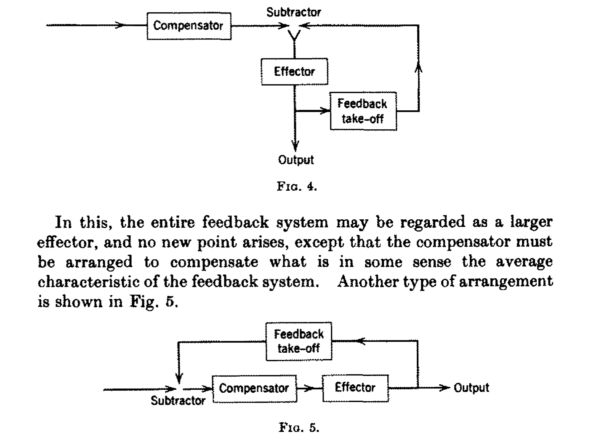

# kybernetik

2026-04-18

[to
commit](https://github.com/esteeschwarz/SPUND-LX/commit/?meta:git-sha)

    [1] "engine on..."

# general

Norbert Wiener, der u.u. als begründer der (damals) modernen kybernetik
(dem wortlaut nach…) betrachtet werden kann, war mathematiker am MIT und
umreiszt in der einleitung zur 1961 (1st: 1948) erschienenen Kybernetik
(Wiener (1992)) ihre entstehungsgeschichte in etwa so, dasz eine dort in
den letzten Kriegsjahren des zweiten weltkriegs lockere runde von
wissenschaftlern hauptsächlich der physik, mathematik, soziologie,
psychologie, aber weitestgehend interdisziplinär und offen, im bestreben
zusammenkam, die wissenschaft in der art offenen, fruchtbaren austauschs
zu neuen, grenzüberschreitenden erkenntnissen zu geleiten.

noch während des krieges neu zu entwickelnde technologien wie zb. zur
flugabwehr wurden hier unter wirklich revolutionären ansätzen, die
erkenntnisse aus der mathematik und soziologie/psychologie/physiologie
zu verbinden wusste, erforscht. ziel waren
steuerungs/regelungsmechanismen für eine erfolgreiche flugbahnberechnung
von flugzeugen, die in in erster linie auf einem rückkopplungsmodel
beruhte, das selbständig, ohne weiteres eingreifen von menschen, in der
lage wäre, ihre berechnungen zuerst an empfangene statusmeldungen
anzupassen und weiterhin diese statusmeldungen vorauszuberechnen. in
diesem sinne gleicht das model dem steuermechanismus eines schiffes, das
seine fahrwerksregelung an rückmeldungen vom steuerwerk selbst
fortwährend anzupassen in der lage ist.

 Q: Wiener (1961)

aus diesem grunde entschlossen sich die wissenschaftler, die technik
bzw. “das ganze Gebiet der Regelung und Nachrichtentheorie, ob in der
Maschine oder im Tier, mit dem Namen »Kybernetik« zu benennen, den wir
aus dem griechischen »κvßερvήΤη~« oder »Steuermann« bildeten”. auch
gouverneur udgl. ist hier etymologisch verwurzelt.

der kybernet war also zuerst der sich selbständig regelnde
steuermechanismus einer maschine, eines maschinellen elements, das seine
umgebung beobachtet und anpassungen der steuerung darauf ausrichtet.
insofern also vielleicht schon eine kluge maschine im gegensatz zu rein
prozessorientierten starren regelungsmechanismen.

zuhilfe kamen den wissenschaftlern erkenntnisse über soziologische
prozesse, physiologische beobachtungen von neuronalen netzen oder auch
die mathematik und biologie in natürlichen wachstumsprozessen. damit
reicht das fundament der kybernetik schon sehr weit in unser heutiges
verständnis dessen, was u.u. allgemein unter kybernetik verstanden wurde
hinein; also eine mit durchaus menschlichen eigenschaften versehene
maschine, die tätigkeiten des menschen besser, schneller und weniger
fehlerbehaftet ausführen kann. das wesentlich ist hier natürlich die
schnelligkeit der maschinellen prozesse. basierend auf bestehenden
rechenmaschinen, die selbst ihre anfänge in den forschungen von charles
babbage und ada lovelace in den 30er jahren des 19jh genommen haben
mögen, wurde deren technik an notwendige höhere rechenleistungen
angepasst, die jdfs. nicht mehr rein mechanisch vonstatten ging sondern
mithilfe elektronischer bauteile perfektioniert wurde. auch hier kamen
wieder forschungen aus der physik, nachrichtentechnik und physiologie
zusammen, um die rechenleistung effektiver zu gestalten.

# references

Wiener, Norbert. 1961. *Cybernetics or Control and Communication in the
Animal and the Machine*. MIT Press.
<http://archive.org/details/wiener-1938>.

Wiener, Norbert. 1992. *Kybernetik: Regelung Und Nachrichtenübertragung
Im Lebewesen Und in Der Maschine (MIT, 1948)*. 2nd ed. Econ Classics.
ECON-Verl.

