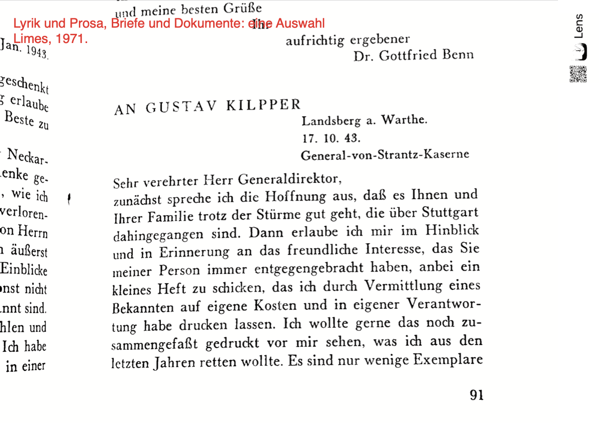
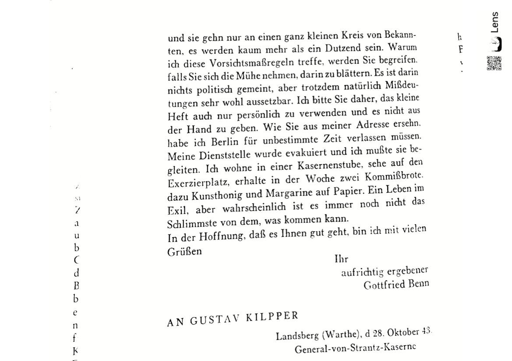

# 16192.benn.VI
das wird kein thesenpapier zum verlorenen ich. das wird nur die vorbereitung des samstag, 2. mai 2026..., dem 140. geburtstag benns.

- aufstehn: 0314
- temperatur: 16°
- dunkel, amsel. autobahn. paperboys.
- flitz: das lesen.

## samling
### list of digital and analogue registrates
#### primaere
- @benn_ausgewahlte_1957, @benn_gesammelte_1958, @benn_gesammelte_1960, @benn_gesammelte_1982, @benn_gesammelte_1990, @benn_gesammelte_1989, @benn_lyrik_1971, @benn_den_1966

#### secundaere
- @koch_gottfried_1970, @hertel_modernes_2017, @hanna_benn-handbuch_2016

es sieht so aus, als wenn die beschäftigung vorbereitet war.

> 1997, die barke. linktree: dtv, lyrik des expressionistischen jahrzehnts (@benn_lyrik_1962), paperobject, flomarkt vor dem rathaus schöneberg. also bayrisches viertel. also benn, cirque fermee. seitdem.

benn 1886, pastorensohn, westpriegnitz. theologie/philologie, marburg etc., dann medizin, berlin. seitdem.

pathologie: krankenhaus westend, städt. krankenhaus sophie-charlottenstrasze. in diesem radius bewege seit 20 jahren zwischen friedhof-autobahn. cirque fermee.

militärarzt, militär kein-arzt, dichten als notwendigkeit. die morgue.

praxis friedenau arzt für geschlechtskrankheiten. dichten als notwendigkeit. europas geschlechte. die syphilis von berlin.

1907 liest nietzsche. erkennt sich. das geistergespräch: mit sich im andern reden. vor allem mit sich über die griechen und den niedergang des abendlands. (@hertel_modernes_2017)

pause. order items chronologically. der erste weltkrieg, der zweite weltkrieg. fanatismus, ausschlusz, rehabilitation. immerwieder auch "rasse". 

> @wolf_etymologischer_2021 - warum muss e. lasker-schüler ein gegensatz sein von jüdisch / deutsch [...] (benns totenrede als klappentext.)

generell seine liebschaften, buch d. könige (@theweleit_buch_1988), an u. ziebarths wohnung immer vorbeigeschlichen, bis auch sie dann als letzte usw.; u. ziebarth 1 urne in DIII, aber es wird noch andere geben vielleicht. cirque fermee.

auch zehlendorf: zum geburtstag blühende waldsteinia (bodendeckende dauerbepflanzung) und violen (wechselbepflanzung) zum todestag die begonien (auch im wechsel, schale.) die eibenhecke gepflegt, ehrengrab (roter ton), nebenan wer weisz das schon aus welchen gründen hier liegen...

## und das verlorene Ich?
das war nur der klappentext. ich bin noch nicht in der lage, leidenschaft in wissenschaft zu verwandeln.

es könnte immerhin sein, dasz [dieser Brief (s.u.)](benn_kilpper_1943_brief.pdf) mit bezug auf den privatdruck einer kleinen sammlung 22 gedichte auch zum verlorenen ich führt. 

Q: @benn_lyrik_1971

die statischen gedichte, als deren teil unser behandeltes gedicht dann schlieszlich 1948 veröffentlicht wurde, sind benns (gedankenlyrik), "elegische Bestimmung und Beschwörung einer Endzeit; das Poetologische; das Religiöse; und die Zeitgeschichte, vor allem der Triumph der Kunst über die Geschichte" (@hanna_benn-handbuch_2016) bestimmen das sujet.

### thesen?
das dorische: faszination, besser: [nietzsche-fanatische] begeisterung für dionys. auch hier fortwährend konflikt zu spüren. benns apoll: quanten, neuronen, synapsen, generell: haut- und geschlechtskrankheiten. das atom. lyrik [im essay](https://esteeschwarz.github.io/SPUND-LX/pages/004/nietzsche-qa.html#:~:text=Zeichen-Material). sprache ist nur interessant, sofern sie beides hat.

