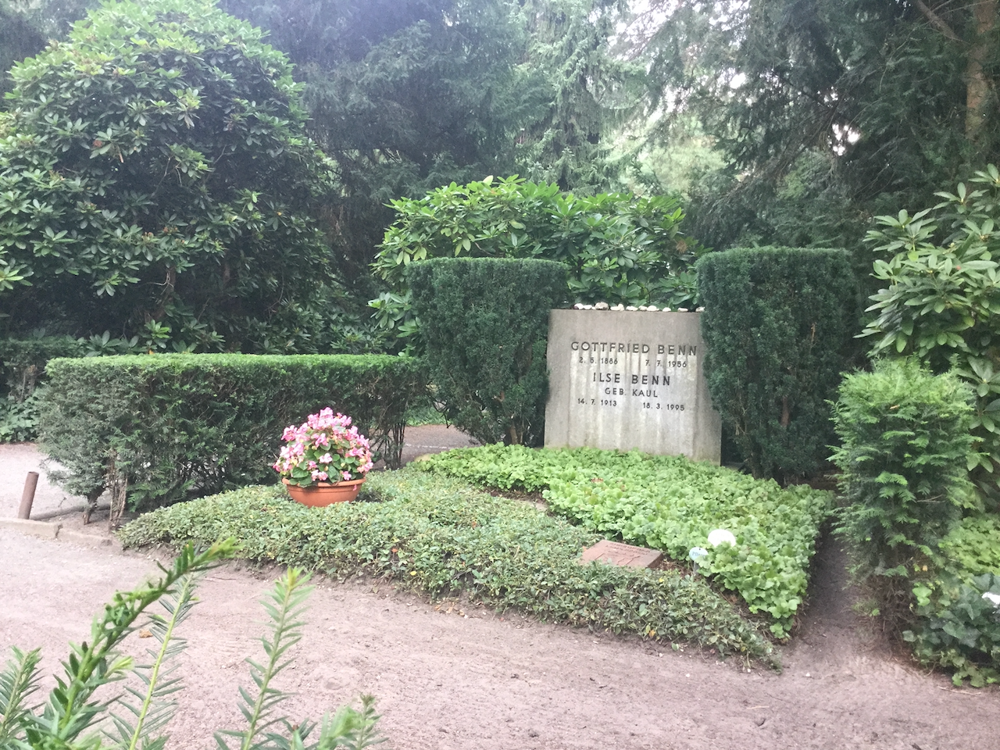
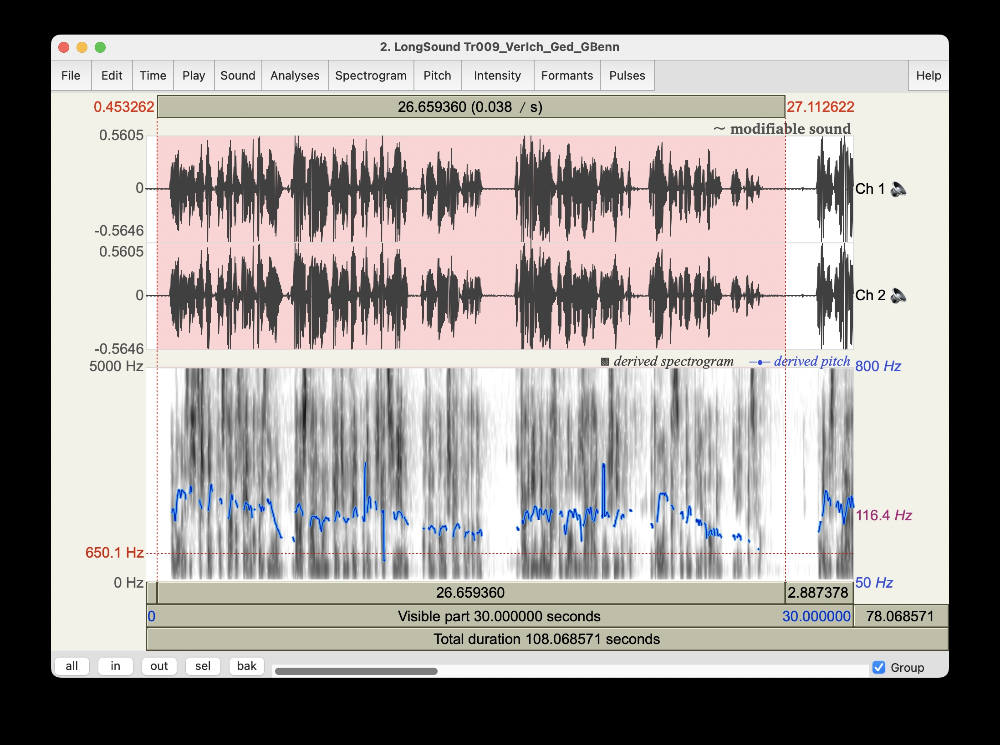
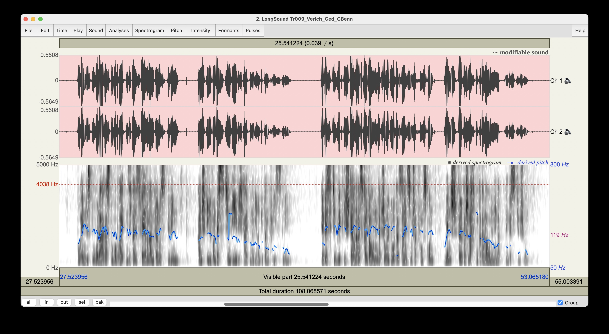
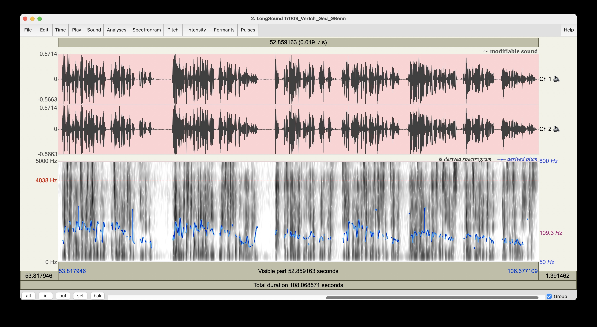

::: {.content-visible when-format="html"}

:::


[to commit](https://github.com/esteeschwarz/SPUND-LX/commit/)

```{r,echo=F,eval=T}
print("engine on...")
```


# index
## benn: *-05-02
:: ```r 2026-1886``` [jahre german dionys::](benn.qmd)   

### der pastorensohn
[...und gott::](benn_walter_lenning-1970-05-02.pdf)   
Q: das läszt sich nicht mehr eruieren. ein zeitungsblatt (walter lenning, 1970-05-02) in einem nachgelassenen benn buch.

### gemeinfrei: 2026-12-31


### play
1-2: benn/benn ©Zweitausendeins   
3-5: kinski/nietzsche ©hörverlag     

::: {.content-visible when-format="html"}
<iframe src="https://box.dh-index.org/estee/play/vi/?audio=benn" width="100%" height="400px"></iframe>
:::

::: {.content-visible when-format="latex"}
weil Sie durchaus im pdf lesen, kein frame, sondern 1 link zur playlist: 

[https://box.dh-index.org/estee/play/vi/?audio=benn](https://box.dh-index.org/estee/play/vi/?audio=benn)
:::

#### analysis: pitch, spectrogram





Q: praat [link to programm](https://praat.org)

#### interpretation?
- 2 pitch peaks, massive down end.



# references