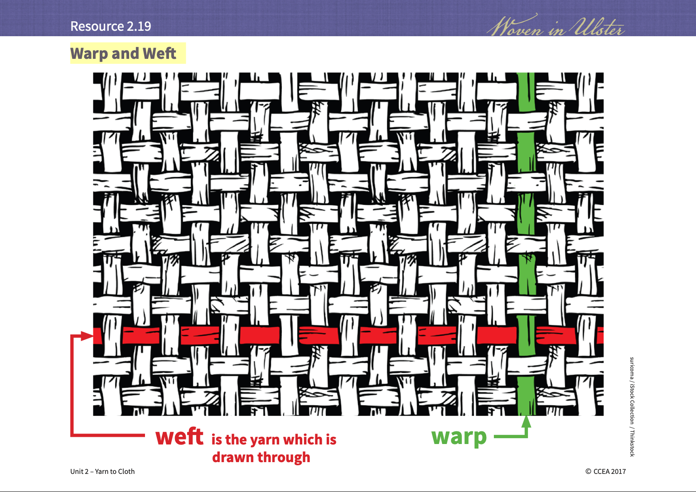

::: {.content-visible when-format="html"}

:::

 

```{r,echo=F,eval=T}
print("engine on...")
#val <- quarto::quarto_metadata$get("meta")
#meta <- knitr::metadata
#params <- meta$
#val<-params$tmeta
val.f<-"fixed val"
val.c<-""
```


# index
1. samling: margin notes general > [open](textur-qa.qmd){.btn .btn-cat}
2. [on kybernetik...](textur002.qmd)

## Q 

- @smith_thread_2020, @smith_thread_2022
- @rosing_textile_2024  

## samling
> I intend to take pictures of plants and feed them to a machine-learning algorithm, which will then generate images of new digital vegetation based on the images I feed it. 
It knows what it means to be an image from the inside out, with no regard for the outside in.   
Working together with the machine-learning algorithm, I will weave and unravel artificial plant images on screen. A *Flora digitalica*, I told the committee. (@smith_thread_2022, p.10)

### vector space of plants
- embeddings: where in an n-dimensional vector space representing (nature) is one specific plant located?

## play



 
