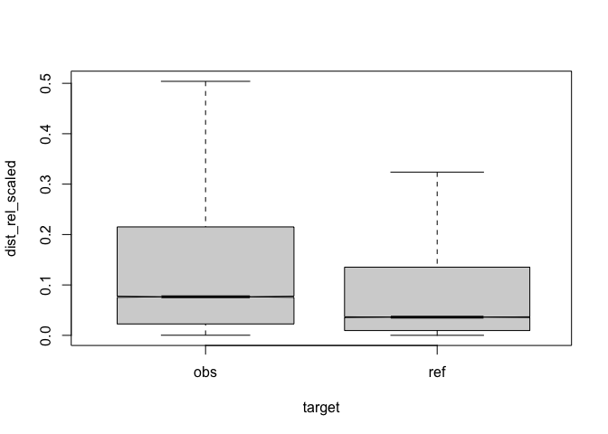
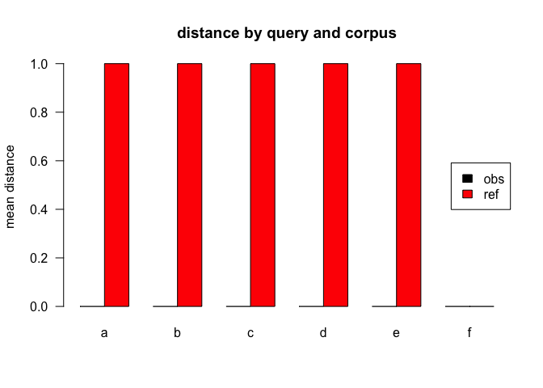
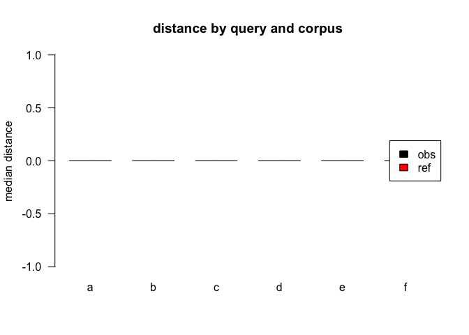
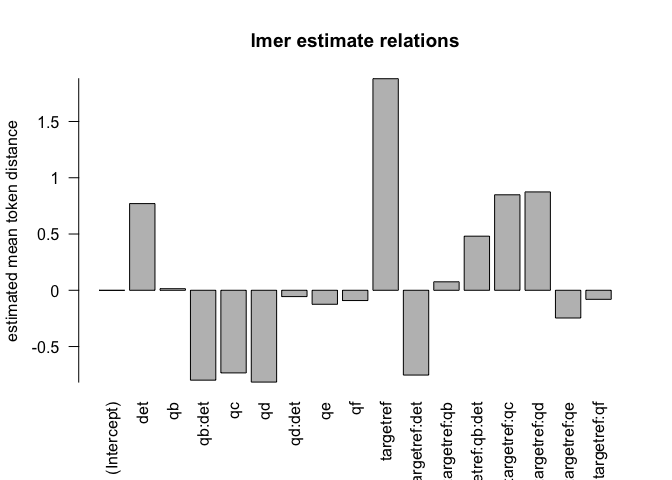
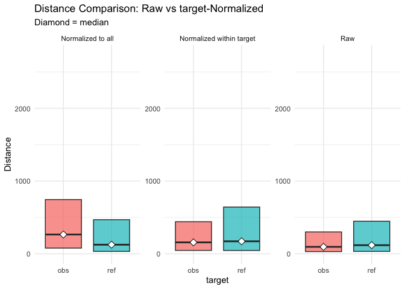

<style type="text/css">
/*table {
  width: 100% !important;
  
}*/
pre {
border: 1px solid black;
border-radius: 0.25rem;
background-color: rgba(0, 0, 0, 0.04);

}
</style>


<style type="text/css">
/*table {
  width: 100% !important;
  
}*/
pre {
border: 1px solid black;
border-radius: 0.25rem;
background-color: rgba(0, 0, 0, 0.04);

}
</style>


``` r
#dataset<-7
#prelim
```


# appendix
overall wordcount of paper: 2639.

## legende

Table: (\#tab:legend)model vars

|variable    |explanation                                |values                  |
|:-----------|:------------------------------------------|:-----------------------|
|target      |corpus                                     |obs,ref                 |
|q           |condition                                  |a,b,c,d,e,f             |
|det         |antecedent POS==DET                        |TRUE,FALSE              |
|aut_id      |author                                     |author hash             |
|lemma       |lemma                                      |noun lemma              |
|range       |url range of distance devised              |1..maxlength(urlthread) |
|embed.score |semantic similarity score lemma vs. thread |0..1                    |
|q:a         |query condition                            |.*                      |
|q:b         |query condition                            |this,that,those,these   |
|q:c         |query condition                            |the                     |
|q:d         |query condition                            |a,an,any,some           |
|q:e         |query condition                            |my                      |
|q:f         |query condition                            |his,her,their,your      |


## evaluation model: 7

### meta 
eval output data: 13, not normalised, distance ceiling =outliers not removed   

### parameter setting


```
##             value
## norm_target      
## det.t        TRUE
## limit       FALSE
## author       TRUE
## url          TRUE
## embed1       TRUE
## embed2          c
## range1       TRUE
## range2          c
## rel         FALSE
## lme         FALSE
## lemma       FALSE
```


### anova analysis
#### anova plain
formula: [``` dist ~ target*q*det ```]


```
##                  Df     Sum Sq    Mean Sq  F value  Pr(>F)    
## target            1 1.1152e+11 1.1152e+11 268.8154 < 2e-16 ***
## q                 5 9.8792e+08 1.9758e+08   0.4763 0.79425    
## det               1 4.1537e+08 4.1537e+08   1.0012 0.31702    
## target:q          5 2.3050e+09 4.6101e+08   1.1112 0.35184    
## target:det        1 2.7199e+09 2.7199e+09   6.5561 0.01045 *  
## q:det             2 2.4028e+08 1.2014e+08   0.2896 0.74857    
## target:q:det      1 7.0024e+06 7.0024e+06   0.0169 0.89663    
## Residuals    142304 5.9037e+13 4.1487e+08                     
## ---
## Signif. codes:  0 '***' 0.001 '**' 0.01 '*' 0.05 '.' 0.1 ' ' 1
```

#### anova of linear regression model
[`anova(summary(lmer))`]


```
## Type III Analysis of Variance Table with Satterthwaite's method
##                  Sum Sq    Mean Sq NumDF  DenDF F value   Pr(>F)   
## target       1241192858 1241192858     1   3127  9.1391 0.002522 **
## q             459276050   91855210     5 110495  0.6763 0.641356   
## det                4960       4960     1  88810  0.0000 0.995178   
## target:q     1113605267  222721053     5 118594  1.6399 0.145579   
## target:det    471676558  471676558     1 114708  3.4730 0.062379 . 
## q:det         195024637   97512318     2  99809  0.7180 0.487730   
## target:q:det   24792885   24792885     1 114158  0.1826 0.669188   
## ---
## Signif. codes:  0 '***' 0.001 '**' 0.01 '*' 0.05 '.' 0.1 ' ' 1
```

#### linear regression coefficients
formula: [``` dist ~ target*q*det+(1|aut_id)+(1|range)+(1|embed.score)+(1|url_id) ```]


```
## Linear mixed model fit by REML. t-tests use Satterthwaite's method [
## lmerModLmerTest]
## Formula: eval(expr(lmeform))
##    Data: dfa
## 
## REML criterion at convergence: 3130236
## 
## Scaled residuals: 
##     Min      1Q  Median      3Q     Max 
## -29.277  -0.021  -0.005   0.014  65.701 
## 
## Random effects:
##  Groups      Name        Variance  Std.Dev. 
##  embed.score (Intercept) 1.158e+08 10760.225
##  aut_id      (Intercept) 3.119e+07  5585.027
##  url_id      (Intercept) 1.622e+08 12736.635
##  range       (Intercept) 1.183e+00     1.088
##  Residual                1.358e+08 11653.805
## Number of obs: 142321, groups:  
## embed.score, 49102; aut_id, 8395; url_id, 2145; range, 1280
## 
## Fixed effects:
##                   Estimate Std. Error        df t value Pr(>|t|)    
## (Intercept)         521.21     360.84   3512.17   1.444 0.148704    
## targetref          2191.20     755.92   2425.13   2.899 0.003780 ** 
## qb                   26.07     856.47 109932.94   0.030 0.975715    
## qc                 -962.11     329.78 129674.98  -2.917 0.003530 ** 
## qd                -1854.17   11999.96  88706.02  -0.155 0.877204    
## qe                 -232.25     242.46 136861.80  -0.958 0.338119    
## qf                 -128.81     299.52 133394.66  -0.430 0.667157    
## det                1014.37     288.40 130620.16   3.517 0.000436 ***
## targetref:qb        220.55     954.93 111051.78   0.231 0.817348    
## targetref:qc        726.25     698.37 118807.08   1.040 0.298377    
## targetref:qd       1785.72     689.03 120015.44   2.592 0.009553 ** 
## targetref:qe        191.01     524.96 122227.62   0.364 0.715967    
## targetref:qf         58.65     659.84 119662.84   0.089 0.929174    
## targetref:det     -1554.54     592.83 119340.03  -2.622 0.008737 ** 
## qb:det            -1099.92     952.60 114445.60  -1.155 0.248237    
## qd:det              676.93   11995.27  88670.55   0.056 0.954997    
## targetref:qb:det    578.82    1354.71 114158.06   0.427 0.669188    
## ---
## Signif. codes:  0 '***' 0.001 '**' 0.01 '*' 0.05 '.' 0.1 ' ' 1
## fit warnings:
## fixed-effect model matrix is rank deficient so dropping 7 columns / coefficients
## optimizer (nloptwrap) convergence code: 0 (OK)
## boundary (singular) fit: see help('isSingular')
```

### plots
<div class="figure">
<p class="caption">(\#fig:boxplot17)compare distances by corpus, not normalised, distance ceiling =outliers not removed</p></div>

<div class="figure">
<p class="caption">(\#fig:barplot-mean7)mean distances over query/corpus, not normalised, distance ceiling =outliers not removed</p></div>


Table: (\#tab:dfe-table7)mean/median table for model: 7

|target |q  |     n| mean| median|
|:------|:--|-----:|----:|------:|
|obs    |a  | 46318|  525|     92|
|ref    |a  | 68618| 2305|    118|
|obs    |b  |  2287|  275|    109|
|ref    |b  |  1315| 1771|    111|
|obs    |c  |  6253|  666|     89|
|ref    |c  |  1504| 1147|    119|
|obs    |d  |  6171|  441|    105|
|ref    |d  |  1765| 2214|    124|
|obs    |e  |  4278|  298|    109|
|ref    |e  |   795| 2636|    116|
|obs    |f  |  2520|  249|     77|
|ref    |f  |   497| 1627|    124|


<div class="figure">
<p class="caption">(\#fig:barplot-median7)median distances over query/corpus, not normalised, distance ceiling =outliers not removed</p></div>

<div class="figure">
<p class="caption">(\#fig:lmeplot7)distances relation, not normalised, distance ceiling =outliers not removed</p></div>

<div class="figure">
<p class="caption">(\#fig:gplot7)distances normalised vs. raw</p></div>


