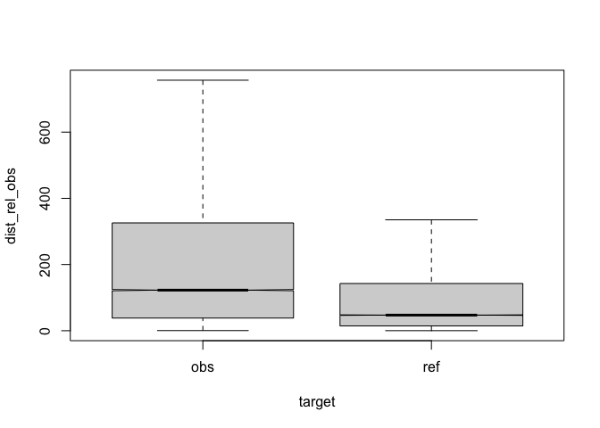
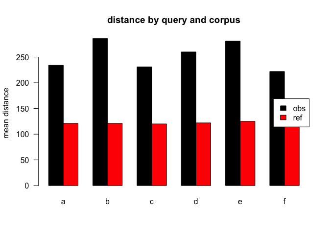
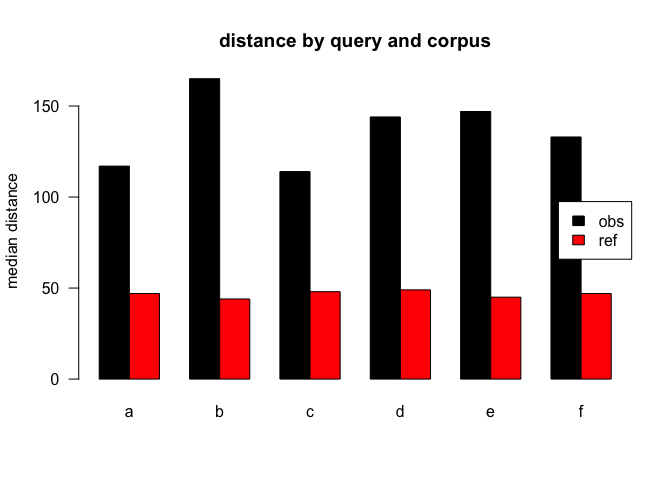
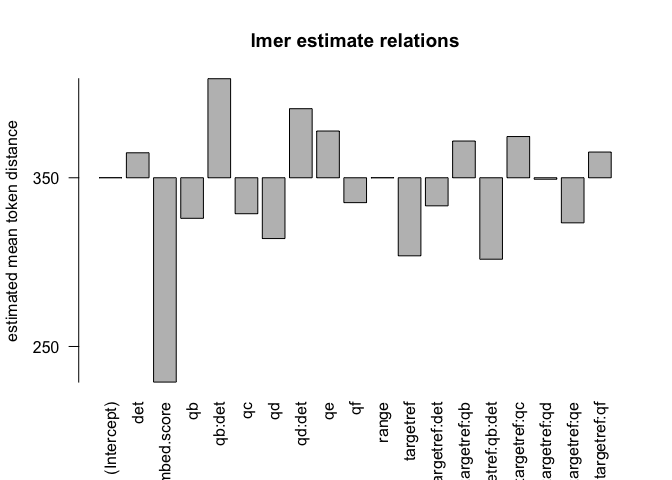
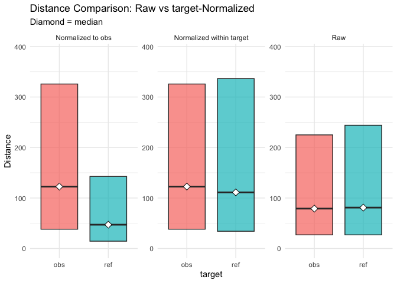

<style type="text/css">
/*table {
  width: 100% !important;
  
}*/
pre {
border: 1px solid black;
border-radius: 0.25rem;
background-color: rgba(0, 0, 0, 0.04);

}
</style>


``` r
#dataset<-7
```


# appendix
eval output M13, normalised to obs, distance ceiling =  outliers removed.

## citetest, method (M13)
To compute distances we queried a corpus for matching conditions where certain (assumed) determiners appear before similar nouns. In M13 (removed)...   This distance should give us information structural evidence of how strong these noun occurences are connected, i.e. if a noun appears out of the blue mostly or if it somewhere before has been introduced to the audience. In information structure definitions this would be termed with **given and new information** [@prince_toward_1981].

## legende

```
## [1] ", normalised to obs, distance ceiling =  outliers removed"
```


Table: (\#tab:legend)model vars

|variable    |explanation                                |values                  |
|:-----------|:------------------------------------------|:-----------------------|
|target      |corpus                                     |obs,ref                 |
|q           |condition                                  |a,b,c,d,e,f             |
|det         |antecedent POS==DET                        |TRUE,FALSE              |
|aut_id      |author                                     |author hash             |
|lemma       |lemma                                      |noun lemma              |
|range       |url range of distance devised              |1..maxlength(urlthread) |
|embed.score |semantic similarity score lemma vs. thread |0..1                    |
|q:a         |query condition                            |.*                      |
|q:b         |query condition                            |this,that,those,these   |
|q:c         |query condition                            |the                     |
|q:d         |query condition                            |a,an,any,some           |
|q:e         |query condition                            |my                      |
|q:f         |query condition                            |his,her,their,your      |

## anova analysis
### anova plain, formula: [``` dist_rel_obs ~ target*q*det ```]

```
##                  Df     Sum Sq   Mean Sq   F value    Pr(>F)    
## target            1  452303747 452303747 7336.4625 < 2.2e-16 ***
## q                 5   12320667   2464133   39.9688 < 2.2e-16 ***
## det               1    1636109   1636109   26.5380 2.588e-07 ***
## target:q          5    2747371    549474    8.9126 1.786e-08 ***
## target:det        1     251297    251297    4.0761  0.043496 *  
## q:det             2     905292    452646    7.3420  0.000648 ***
## target:q:det      1     717222    717222   11.6335  0.000648 ***
## Residuals    126209 7780971239     61651                        
## ---
## Signif. codes:  0 '***' 0.001 '**' 0.01 '*' 0.05 '.' 0.1 ' ' 1
```

### anova of linear regression model: [`anova(summary(lmer))`]


```
## Type III Analysis of Variance Table with Satterthwaite's method
##                 Sum Sq   Mean Sq NumDF  DenDF   F value    Pr(>F)    
## target         2618718   2618718     1  79483   51.0005 9.313e-13 ***
## q               732070    146414     5 123324    2.8515  0.014059 *  
## det              14450     14450     1 119400    0.2814  0.595768    
## range        318496210 318496210     1  27290 6202.8299 < 2.2e-16 ***
## embed.score   12389668  12389668     1 125991  241.2933 < 2.2e-16 ***
## target:q        933689    186738     5 124373    3.6368  0.002726 ** 
## target:det      540220    540220     1 123982   10.5210  0.001181 ** 
## q:det           390120    195060     2 121665    3.7989  0.022399 *  
## target:q:det    189268    189268     1 124039    3.6861  0.054872 .  
## ---
## Signif. codes:  0 '***' 0.001 '**' 0.01 '*' 0.05 '.' 0.1 ' ' 1
```

### linear regression coefficients, formula: [``` dist_rel_obs ~ target*q*det+(1|aut_id)+range+embed.score ```]

```
## Linear mixed model fit by REML. t-tests use Satterthwaite's method [
## lmerModLmerTest]
## Formula: eval(expr(lmeform))
##    Data: dfa
## 
## REML criterion at convergence: 1733592
## 
## Scaled residuals: 
##     Min      1Q  Median      3Q     Max 
## -3.3198 -0.5695 -0.2131  0.2725  7.0321 
## 
## Random effects:
##  Groups   Name        Variance Std.Dev.
##  aut_id   (Intercept)  7540     86.83  
##  Residual             51347    226.60  
## Number of obs: 126226, groups:  aut_id, 8238
## 
## Fixed effects:
##                    Estimate Std. Error         df t value Pr(>|t|)    
## (Intercept)       3.504e+02  4.228e+00  3.672e+04  82.886  < 2e-16 ***
## targetref        -4.627e+01  2.941e+00  8.918e+03 -15.729  < 2e-16 ***
## qb               -2.402e+01  1.560e+01  1.217e+05  -1.540 0.123597    
## qc               -2.131e+01  5.605e+00  1.222e+05  -3.802 0.000144 ***
## qd               -3.603e+01  2.283e+02  1.194e+05  -0.158 0.874604    
## qe                2.771e+01  3.890e+00  1.236e+05   7.123 1.06e-12 ***
## qf               -1.474e+01  4.958e+00  1.232e+05  -2.973 0.002946 ** 
## det               1.480e+01  4.867e+00  1.225e+05   3.042 0.002354 ** 
## range            -2.763e-02  3.508e-04  2.729e+04 -78.758  < 2e-16 ***
## embed.score      -1.211e+02  7.796e+00  1.260e+05 -15.534  < 2e-16 ***
## targetref:qb      2.177e+01  1.760e+01  1.226e+05   1.238 0.215900    
## targetref:qc      2.444e+01  1.317e+01  1.251e+05   1.856 0.063477 .  
## targetref:qd     -8.566e-01  1.291e+01  1.251e+05  -0.066 0.947118    
## targetref:qe     -2.672e+01  9.785e+00  1.250e+05  -2.730 0.006326 ** 
## targetref:qf      1.525e+01  1.245e+01  1.248e+05   1.225 0.220738    
## targetref:det    -1.664e+01  1.117e+01  1.253e+05  -1.490 0.136307    
## qb:det            5.871e+01  1.714e+01  1.218e+05   3.425 0.000614 ***
## qd:det            4.094e+01  2.283e+02  1.194e+05   0.179 0.857667    
## targetref:qb:det -4.828e+01  2.514e+01  1.240e+05  -1.920 0.054872 .  
## ---
## Signif. codes:  0 '***' 0.001 '**' 0.01 '*' 0.05 '.' 0.1 ' ' 1
## fit warnings:
## fixed-effect model matrix is rank deficient so dropping 7 columns / coefficients
## Some predictor variables are on very different scales: consider rescaling
```

## plots
<div class="figure">
<p class="caption">(\#fig:boxplot1)compare distances by corpus, normalised to obs, distance ceiling =  outliers removed</p></div>

<div class="figure">
<p class="caption">(\#fig:barplot-median)mean distances over query/corpus, normalised to obs, distance ceiling =  outliers removed</p></div>


Table: (\#tab:dfe-table)mean/median table for M13

|target |q  |     n| mean| median|
|:------|:--|-----:|----:|------:|
|obs    |a  | 42836|  234|    117|
|ref    |a  | 58615|  121|     47|
|obs    |b  |  2116|  286|    165|
|ref    |b  |  1130|  121|     44|
|obs    |c  |  5770|  231|    114|
|ref    |c  |  1274|  120|     48|
|obs    |d  |  5654|  260|    144|
|ref    |d  |  1525|  122|     49|
|obs    |e  |  3911|  281|    147|
|ref    |e  |   671|  125|     45|
|obs    |f  |  2311|  222|    133|
|ref    |f  |   413|  116|     47|


<div class="figure">
<p class="caption">(\#fig:barplot-mean)median distances over query/corpus, normalised to obs, distance ceiling =  outliers removed</p></div>

<div class="figure">
<p class="caption">(\#fig:lmeplot)distances relation, normalised to obs, distance ceiling =  outliers removed</p></div>

<div class="figure">
<p class="caption">(\#fig:gplot)distances normalised vs. raw</p></div>
-----

## REF
literature used and alii...   


