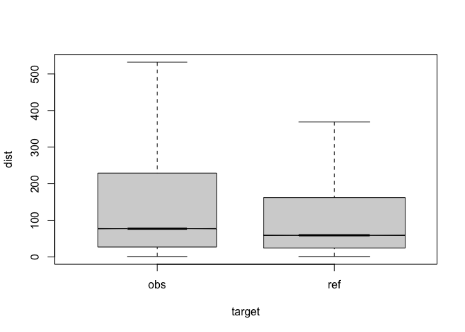
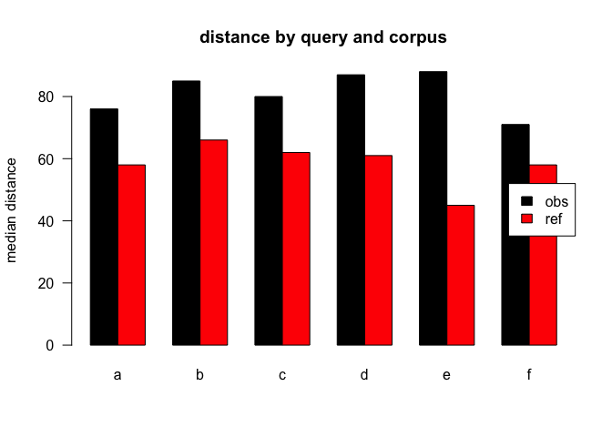
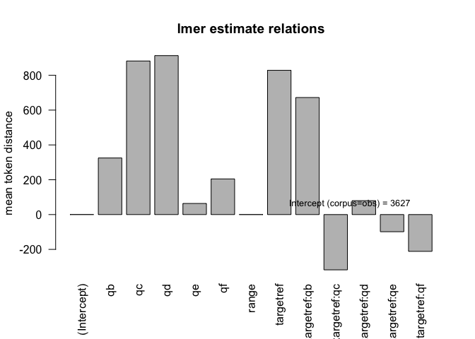

``` r
#dataset<-7
```


# top

eval output M7

``` r
s1<-eval.1$anova.plain
p.select<-c("target|target:q")
p.an<-s1[grep(p.select,rownames(s1)),]
p.an
```

    ##              Df     Sum Sq    Mean Sq F value    Pr(>F)    
    ## target        1 1.2468e+09 1.2468e+09  4.8904   0.02701 *  
    ## target:q      5 6.9820e+09 1.3964e+09  5.4772 4.797e-05 ***
    ## target:det    1 2.0619e+10 2.0619e+10 80.8767 < 2.2e-16 ***
    ## target:q:det  3 2.1915e+10 7.3049e+09 28.6527 < 2.2e-16 ***
    ## ---
    ## Signif. codes:  0 '***' 0.001 '**' 0.01 '*' 0.05 '.' 0.1 ' ' 1

``` r
s2<-eval.1$anova.lme
p.an.lm<-s2[grep(p.select,rownames(s2)),]
p.an.lm
```

    ## Type III Analysis of Variance Table with Satterthwaite's method
    ##              Sum Sq    Mean Sq NumDF  DenDF F value    Pr(>F)    
    ## target   2.2770e+10 2.2770e+10     1 932378 91.8099 < 2.2e-16 ***
    ## target:q 4.3533e+09 8.7066e+08     5 938887  3.5106  0.003563 ** 
    ## ---
    ## Signif. codes:  0 '***' 0.001 '**' 0.01 '*' 0.05 '.' 0.1 ' ' 1

``` r
s3<-eval.1$lme
dfe<-eval.1$plot.md
s3
```

    ## Linear mixed model fit by REML. t-tests use Satterthwaite's method [
    ## lmerModLmerTest]
    ## Formula: eval(expr(lmeform))
    ##    Data: dfa
    ## 
    ## REML criterion at convergence: 20841309
    ## 
    ## Scaled residuals: 
    ##    Min     1Q Median     3Q    Max 
    ## -9.896 -0.044 -0.003  0.015 47.642 
    ## 
    ## Random effects:
    ##  Groups   Name        Variance  Std.Dev.
    ##  lemma    (Intercept)  70196632  8378   
    ##  det      (Intercept)  16327221  4041   
    ##  Residual             248011890 15748   
    ## Number of obs: 939879, groups:  lemma, 4157; det, 2
    ## 
    ## Fixed effects:
    ##                Estimate Std. Error         df t value Pr(>|t|)    
    ## (Intercept)   3.627e+03  2.862e+03  1.044e+00   1.267  0.41858    
    ## targetref     8.285e+02  6.077e+01  8.896e+05  13.635  < 2e-16 ***
    ## qb            3.250e+02  1.608e+02  9.390e+05   2.021  0.04330 *  
    ## qc            8.821e+02  1.068e+02  9.395e+05   8.255  < 2e-16 ***
    ## qd            9.131e+02  1.113e+02  9.398e+05   8.206 2.28e-16 ***
    ## qe            6.379e+01  1.321e+02  9.390e+05   0.483  0.62913    
    ## qf            2.047e+02  1.618e+02  9.389e+05   1.265  0.20592    
    ## range        -1.277e-01  1.006e-02  9.333e+05 -12.694  < 2e-16 ***
    ## targetref:qb  6.723e+02  2.211e+02  9.386e+05   3.041  0.00236 ** 
    ## targetref:qc -3.175e+02  1.291e+02  9.393e+05  -2.459  0.01394 *  
    ## targetref:qd  7.986e+01  1.400e+02  9.396e+05   0.570  0.56842    
    ## targetref:qe -9.853e+01  2.608e+02  9.382e+05  -0.378  0.70557    
    ## targetref:qf -2.113e+02  2.219e+02  9.388e+05  -0.952  0.34096    
    ## ---
    ## Signif. codes:  0 '***' 0.001 '**' 0.01 '*' 0.05 '.' 0.1 ' ' 1

    ## 
    ## Correlation matrix not shown by default, as p = 13 > 12.
    ## Use print(x, correlation=TRUE)  or
    ##     vcov(x)        if you need it

    ## fit warnings:
    ## Some predictor variables are on very different scales: consider rescaling






