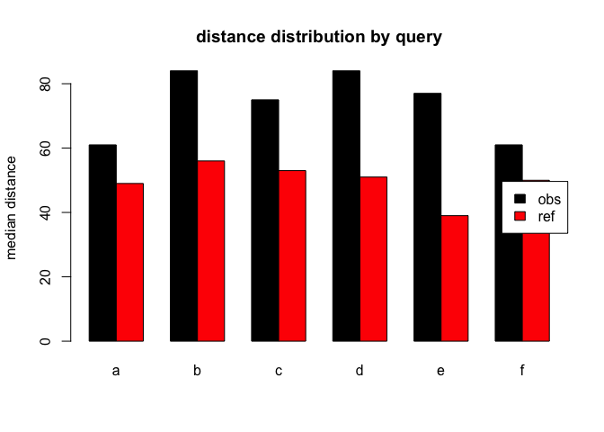

------------------------------------------------------------------------

# xTitle

# proposition & coherence in :schizophrenia: threads

### stephan schwarz / a. stefanowitsch:16827_25S:sprache und psychose

## subject

Investigate reference marking, coherence and information structure in
schizophrenia language by measuring distance of similar nouns within
range of comment thread preceded by certain determinants.[^1]

## background

Inspired by Zimmerer et al. ([2017](#ref-zimmerer_deictic_2017)) we are
interested in observations concerning coherence and propositional
conditions in schizophrenia language, as these linguistic markers appear
underinvestigated in research while they seem to play a crucial role
within target group language. (As such seen as asset of thinking or
world building capacity which might suffer from linguistic deficits
within the range of positive symptoms.)

## method

To compute distances we queried a corpus for matching conditions where
certain (assumed) determiners appear before similar nouns. This distance
should give us information structural evidence of how strong these noun
occurences are connected, i.e. if a noun appears out of the blue mostly
or if it somewhere before has been introduced to the audience. In
information structure definitions this would be termed with **given and
new information** ([Prince 1981](#ref-prince_toward_1981)).

------------------------------------------------------------------------

## questions

Measuring the referent-reference distance which we here assume as
indicator of coherence we hope to find empirical evidence for disturbed
or not world building capabilities within schizophrenia language.
Premising that a large noun distance indicates a low reference-referent
association we hypothesise that in a language/ToM setting where the
speakers estimation of the audiences context understanding capacities is
disturbed we will find higer medium scores for the distance under
matching conditions.

## daten

We built a corpus of the reddit r/schizophrenia thread (`n=755074`
tokens) and a reference corpus of r/unpopularopinion (`n=271563`). The
corpus has been pos-tagged using the R udpipe:: package ([Wijffels
2023](#ref-wijffels_udpipe_2023)) which tags according to the universal
dependencies tagset maintained by ([De Marneffe et al.
2021](#ref-de_marneffe_universal_2021)). Still the 755074 tokens can
only, with the workflow of growing the corpus and devising the noun
distances developed be just a starting point from where with more
datapoints statistical evaluation becomes relevant first.\
The dataframe used for modeling consists of `87145` distance datapoints
derived from the postagged corpus.

  -----------------------------------------------------------------------------
            dist q     target     url lemma             range   corpsize det
  ------- ------ ----- -------- ----- --------------- ------- ---------- ------
  27446       75 d     obs        903 people             5381     755074 TRUE

  14095      882 a     obs        926 notice             1832     755074 TRUE

  11953       27 a     obs        897 people             5685     755074 TRUE

  67142        8 c     ref         44 burger             6207     271563 TRUE

  20186      148 c     obs        829 schizophrenia      1795     755074 TRUE

  75425       80 d     ref         19 belief             5000     271563 TRUE

  44854       27 a     ref         44 burger             6207     271563 TRUE

  68684       15 c     ref         52 gender             3469     271563 TRUE

  44995        7 a     ref         44 burger             6207     271563 TRUE

  52830       13 a     ref         68 show               3600     271563 TRUE
  -----------------------------------------------------------------------------

------------------------------------------------------------------------

## results



    ## ## conditions:

  q   precedent               pos
  --- ----------------------- ------
  a   ALL (.\*)               NOUN
  b   this,that,these,those   NOUN
  c   the                     NOUN
  d   a,an,some,any           NOUN
  e   my                      NOUN
  f   your,their,his,her      NOUN

------------------------------------------------------------------------

## conclusion

Over all conditions
````<!--**B** (``` this, that, these, those, DET ```)-->````{=html}we
find significantly higher distance scores in the target corpus which
proves our hypothesis. An ANOVA analysis of the linear regression model
(cf. [Bates et al. 2015](#ref-bates_fitting_2015)) which posited a main
effect of corpus\*q+range and random effects of lemma
(`lme4::lmer(dist ~ corp*q+range + (1|lemma`) gets a p-value of
`p=0.0000066` for the mean difference of `-25` tokens (targetref)
compared to the target.\
So the median distance of nouns, preceded by one of our queries, with
`60` tokens width for the target corpus and `50` in the reference
corpus, is also with respect to the covariates significantly (`p<0.001`)
higher but still to be tested on a larger corpus.

# REF

Bates, Douglas, Martin Mächler, Ben Bolker, and Steve Walker. 2015.
"Fitting Linear Mixed-Effects Models Using Lme4." *Journal of
Statistical Software* 67 (1): 1--48.
<https://doi.org/10.18637/jss.v067.i01>.

De Marneffe, Marie-Catherine, Christopher D. Manning, Joakim Nivre, and
Daniel Zeman. 2021. "Universal Dependencies." *Computational
Linguistics*, May, 1--54. <https://doi.org/10.1162/coli_a_00402>.

Prince, Ellen F. 1981. "Toward a Taxonomy of Given-New Information." In
*Syntax and Semantics: Vol. 14. Radical Pragmatics*, edited by P. Cole,
223--55. New York: Academic Press.

Wijffels, Jan. 2023. *Udpipe: Tokenization, Parts of Speech Tagging,
Lemmatization and Dependency Parsing with the 'UDPipe' 'NLP' Toolkit*.
<https://CRAN.R-project.org/package=udpipe>.

Zimmerer, Vitor C., Stuart Watson, Douglas Turkington, I. Nicol Ferrier,
and Wolfram Hinzen. 2017. "Deictic and Propositional Meaning---New
Perspectives on Language in Schizophrenia." *Frontiers in Psychiatry* 8
(February). <https://doi.org/10.3389/fpsyt.2017.00017>.

[^1]: snc.1:h2.pb.1000char/pg.queries
