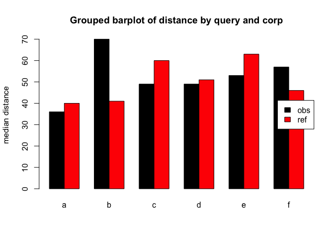

```
## [1] "/Users/guhl/Documents/GitHub/SPUND-LX/psych/HA/"
```

```
##              coeff
## intercept   13.751
## corpusA     48.497
## range        0.035
## m_rel     1965.243
## cond_a    1925.276
## cond_b    1925.980
## cond_c    1922.718
## cond_d    1941.924
## cond_e    1940.450
```

---

# xTitle
# proposition & coherence in :schizophrenia: threads
### stephan schwarz / a. stefanowitsch:16827_25S:sprache und psychose
## subject
Investigate reference marking, coherence and information structure in schizophrenia language by measuring distance of similar nouns within range of comment thread preceded by certain determinants.[^1]
## background
Inspired by Zimmerer et alii (#REF) we are interested in observations concerning coherence and propositional conditions in schizophrenia language, as these linguistic markers appear underinvestigated in research while they seem to play a crucial role within target group language. (As such seen as asset of thinking or world building capacity which might suffer from linguistic deficits within the range of positive symptoms.)
## method
To compute distances we queried a corpus for matching conditions where certain (assumed) determiners appear before similar nouns. This distance should give us information structural evidence of how strong these noun occurences are connected, i.e. if a noun appears out of the blue mostly or if it somewhere before has been introduced to the audience. In information structure definitions this would be termed with **given and new information** Prince (1981#REF).
----
## questions
Measuring the referent-reference distance which we here assume as indicator of coherence we hope to find empirical evidence for disturbed or not world building capabilities within schizophrenia language. Premising that a large noun distance indicates a low reference-referent association we hypothesise that in a language/TOM setting where the speakers estimation of the audiences context understanding capacities is disturbed we will find higer medium scores for the distance under matching conditions.
## daten
We built a corpus of the reddit r/schizophrenia thread (```n=747089 ``` tokens) and a reference corpus of r/unpopularopinion (```n=265670 ```). The corpus has been pos-tagged using the R udpipe:: package #REF which tags according to the universal dependencies tagset maintained by #REF. Still the 747089 tokens can only, with the workflow of growing the corpus and devising the noun distances developed be just a starting point from where with more datapoints statistical evaluation becomes relevant first.


----
## results


```
##    q dist  range corp corp_size      m   m_rel    ld
## 1  a   36  446.0  obs    747089 747089 1.00000 0.045
## 2  b   70 1451.0  obs    747089  11415 0.01528 0.045
## 3  c   49  807.0  obs    747089  12516 0.01675 0.045
## 4  d   49  834.0  obs    747089  15141 0.02027 0.045
## 5  e   53  917.0  obs    747089   6983 0.00935 0.045
## 6  f   57 1119.0  obs    747089   4236 0.00567 0.045
## 7  a   40 1619.5  ref    265670 265670 1.00000 0.076
## 8  b   41 2140.0  ref    265670   4213 0.01586 0.076
## 9  c   60 2116.5  ref    265670   6542 0.02462 0.076
## 10 d   51 1863.0  ref    265670   6349 0.02390 0.076
## 11 e   63 2947.5  ref    265670    662 0.00249 0.076
## 12 f   46 2473.5  ref    265670   1576 0.00593 0.076
```


```
## {"a":{"token":["#intercept"]},"b":{"token":["this","that","these","those"]},"c":{"token":["the"]},"d":{"token":["a","an","some","any"]},"e":{"token":["my"]},"f":{"token":["your","their","his","her"]}}
```


```
##   dist q target url lemma range      mf_rel        ld
## 1   20 a    obs  38 chemo   606 0.003300330 0.5016502
## 2   20 a    obs  45 angel   663 0.006033183 0.4374057
## 3  186 a    obs  45 angel   663 0.006033183 0.4374057
## 4  424 a    obs  45 angel   663 0.006033183 0.4374057
## 5   21 a    obs  16 dream   101 0.019801980 0.6633663
## 6   13 a    obs  15 world   624 0.006410256 0.4679487
```

```
## [1] "anova_model <- aov(dist ~ target*q, data = df)"
```

```
## Type III Analysis of Variance Table with Satterthwaite's method
##           Sum Sq Mean Sq NumDF DenDF F value       Pr(>F)    
## target   1066004 1066004     1   731 27.2101 0.0000002379 ***
## q         768164  153633     5 10766  3.9215      0.00149 ** 
## target:q  512129  102426     5 10744  2.6145      0.02277 *  
## ---
## Signif. codes:  0 '***' 0.001 '**' 0.01 '*' 0.05 '.' 0.1 ' ' 1
```

----
## conclusion
In condition **B** (``` this, that, these, those ```) which we hold for the most speaking determinants illustrating the speakers idea, that the information about a reference is already **given** we find significantly higher distance scores in the target corpus which proves our hypothesis. The overall p-value of p=0.0672215 for our distances distribution is still to be tested for dependency on a general lexical diversity (type/token-ratio) within the corresponding observed range.
## B. REF:
[^1]:snc.1:h2.pb.1000char/pg.queries
