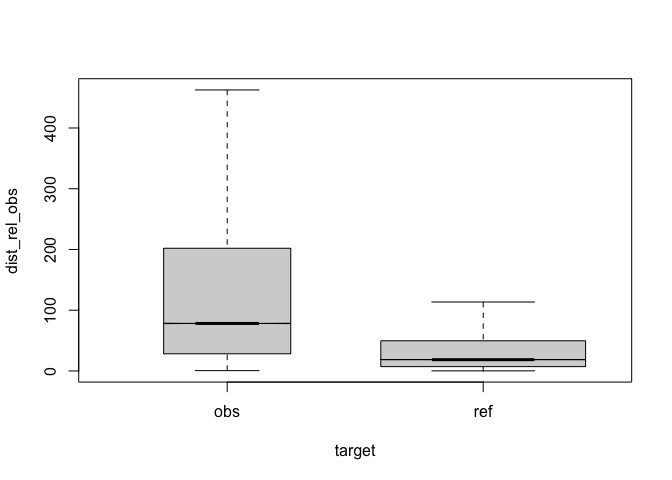

```r
#dataset<-7
```


# top
eval output M8, normalised to obs, distance ceiling =  outliers removed.

## legende

Table: (\#tab:legend)model vars

|variable |explanation         |values                |
|:--------|:-------------------|:---------------------|
|target   |corpus              |obs,ref               |
|q        |condition           |a,b,c,d,e,f           |
|det      |antecedent POS==DET |TRUE,FALSE            |
|q:a      |query condition     |.*                    |
|q:b      |query condition     |this,that,those,these |
|q:c      |query condition     |the                   |
|q:d      |query condition     |a,an,any,some         |
|q:e      |query condition     |my                    |
|q:f      |query condition     |his,her,their,your    |

## anova analysis
### anova plain, formula: [``` dist_rel_obs ~ target*q*det ```]

```
##                 Df     Sum Sq   Mean Sq   F value  Pr(>F)    
## target           1  188198255 188198255 2623.7365 < 2e-16 ***
## q                5   12386302   2477260   34.5363 < 2e-16 ***
## det              1     331841    331841    4.6263 0.03149 *  
## target:q         5     238670     47734    0.6655 0.64965    
## target:det       1      76742     76742    1.0699 0.30098    
## q:det            1       7767      7767    0.1083 0.74210    
## target:q:det     1         49        49    0.0007 0.97912    
## Residuals    53589 3843890727     71729                      
## ---
## Signif. codes:  0 '***' 0.001 '**' 0.01 '*' 0.05 '.' 0.1 ' ' 1
```

### anova of linear regression model: [`anova(summary(lmer))`]


```
## Type III Analysis of Variance Table with Satterthwaite's method
##               Sum Sq Mean Sq NumDF DenDF F value    Pr(>F)    
## target        942002  942002     1 53142 13.7725 0.0002065 ***
## q            1715931  343186     5 52610  5.0175 0.0001343 ***
## det             1744    1744     1 52047  0.0255 0.8731412    
## target:q      274352   54870     5 52617  0.8022 0.5478174    
## target:det      8778    8778     1 52044  0.1283 0.7201598    
## q:det            434     434     1 52029  0.0063 0.9365173    
## target:q:det    8861    8861     1 52029  0.1296 0.7188976    
## ---
## Signif. codes:  0 '***' 0.001 '**' 0.01 '*' 0.05 '.' 0.1 ' ' 1
```

### linear regression coefficients, formula: [``` dist_rel_obs ~ target*q*det+(1|lemma) ```]

```
##                          Estimate Std. Error        df      t value
## (Intercept)           243.7965379   2.979561  2119.243  81.82297352
## targetref            -107.4276980   3.263483 22754.801 -32.91811569
## qb                    112.6640671  58.645458 51418.076   1.92110473
## qc                     51.6152048   8.217921 53428.938   6.28081016
## qd                     50.8464003   8.023580 53556.537   6.33712174
## qe                     44.5199030   8.824469 53549.660   5.04505200
## qf                     28.3427563  12.622477 53477.546   2.24541945
## detTRUE                -2.8252153   3.608092 53094.140  -0.78302195
## targetref:qb          -87.2953635  81.211171 52049.310  -1.07491817
## targetref:qc           29.9092334  55.112341 52625.641   0.54269576
## targetref:qd           30.7562909  42.785598 52604.280   0.71884682
## targetref:qe           91.8213683  66.529566 52591.052   1.38015883
## targetref:qf         -115.0324610 153.211990 53277.113  -0.75080587
## targetref:detTRUE      -0.1166626   9.597309 53507.166  -0.01215577
## qb:detTRUE            -31.6643478  60.727593 51491.010  -0.52141615
## targetref:qb:detTRUE   51.8533521 144.063338 52029.213   0.35993441
##                           Pr(>|t|)
## (Intercept)           0.000000e+00
## targetref            3.340536e-232
## qb                    5.472403e-02
## qc                    3.393974e-10
## qd                    2.359526e-10
## qe                    4.548774e-07
## qf                    2.474529e-02
## detTRUE               4.336177e-01
## targetref:qb          2.824163e-01
## targetref:qc          5.873416e-01
## targetref:qd          4.722385e-01
## targetref:qe          1.675436e-01
## targetref:qf          4.527728e-01
## targetref:detTRUE     9.903014e-01
## qb:detTRUE            6.020791e-01
## targetref:qb:detTRUE  7.188976e-01
```
## plots
<div class="figure">
<p class="caption">(\#fig:boxplot1)compare distances by corpus, normalised to obs, distance ceiling =  outliers removed</p></div>


|target |q  |     n| mean| median|
|:------|:--|-----:|----:|------:|
|obs    |a  | 31824|  241|    122|
|ref    |a  | 17295|  120|     50|
|obs    |b  |   313|  325|    174|
|ref    |b  |    27|  127|    110|
|obs    |c  |  1226|  291|    156|
|ref    |c  |    24|  168|     99|
|obs    |d  |  1369|  307|    209|
|ref    |d  |    41|  180|    173|
|obs    |e  |  1005|  287|    154|
|ref    |e  |    16|  238|    145|
|obs    |f  |   462|  258|    146|
|ref    |f  |     3|   46|     62|

<div class="figure">
<p class="caption">(\#fig:barplot-median)median distances over query/corpus, normalised to obs, distance ceiling =  outliers removed</p></div>

<div class="figure">
<p class="caption">(\#fig:barplot-mean)mean distances over query/corpus, normalised to obs, distance ceiling =  outliers removed</p></div>

<div class="figure">
<p class="caption">(\#fig:lmeplot)distances relation, normalised to obs, distance ceiling =  outliers removed</p></div>

<div class="figure">
<p class="caption">(\#fig:gplot)distances normalised vs. raw</p></div>
-----

# REF
literature used and alii...   


