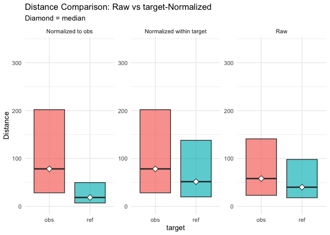

``` r
#dataset<-7
```


# top
eval output M11, normalised to obs, distance ceiling =  outliers removed.

## legende

Table: (\#tab:legend)model vars

|variable |explanation         |values                |
|:--------|:-------------------|:---------------------|
|target   |corpus              |obs,ref               |
|q        |condition           |a,b,c,d,e,f           |
|det      |antecedent POS==DET |TRUE,FALSE            |
|q:a      |query condition     |.*                    |
|q:b      |query condition     |this,that,those,these |
|q:c      |query condition     |the                   |
|q:d      |query condition     |a,an,any,some         |
|q:e      |query condition     |my                    |
|q:f      |query condition     |his,her,their,your    |

## anova analysis
### anova plain, formula: [``` dist_rel_obs ~ target*q*det ```]

```
##                   Df     Sum Sq    Mean Sq    F value    Pr(>F)    
## target             1 3.6884e+09 3688441713 86368.2495 < 2.2e-16 ***
## q                  5 4.5563e+08   91126214  2133.8040 < 2.2e-16 ***
## det                1 2.8130e+07   28129559   658.6794 < 2.2e-16 ***
## target:q           5 2.6402e+06     528048    12.3647 5.105e-12 ***
## target:det         1 2.3260e+06    2325954    54.4643 1.584e-13 ***
## q:det              1 2.7700e+06    2769968    64.8613 8.044e-16 ***
## target:q:det       1 4.3320e+03       4332     0.1014    0.7501    
## Residuals    1045139 4.4634e+10      42706                         
## ---
## Signif. codes:  0 '***' 0.001 '**' 0.01 '*' 0.05 '.' 0.1 ' ' 1
```

### anova of linear regression model: [`anova(summary(lmer))`]


```
## Type III Analysis of Variance Table with Satterthwaite's method
##                Sum Sq Mean Sq NumDF   DenDF  F value    Pr(>F)    
## target        5908779 5908779     1 1041840 153.5090 < 2.2e-16 ***
## q            49397958 9879592     5 1041207 256.6700 < 2.2e-16 ***
## det            895398  895398     1 1040899  23.2623 1.414e-06 ***
## target:q      2262659  452532     5 1041208  11.7567 2.169e-11 ***
## target:det      98820   98820     1 1040899   2.5673   0.10909    
## q:det          755379  755379     1 1040893  19.6246 9.426e-06 ***
## target:q:det   116477  116477     1 1040893   3.0261   0.08194 .  
## ---
## Signif. codes:  0 '***' 0.001 '**' 0.01 '*' 0.05 '.' 0.1 ' ' 1
```

### linear regression coefficients, formula: [``` dist_rel_obs ~ target*q*det+(1|lemma) ```]

```
## Linear mixed model fit by REML. t-tests use Satterthwaite's method [
## lmerModLmerTest]
## Formula: eval(expr(lmeform))
##    Data: dfa
## 
## REML criterion at convergence: 14012116
## 
## Scaled residuals: 
##     Min      1Q  Median      3Q     Max 
## -5.3322 -0.5018 -0.1443  0.1039 11.4879 
## 
## Random effects:
##    Groups        Name Variance Std.Dev.
##     lemma (Intercept)    49298    222.0
##  Residual                38491    196.2
## Number of obs: 1045155, groups:  lemma, 3652
## 
## Fixed effects:
##                        Estimate Std. Error         df  t value Pr(>|t|)    
## (Intercept)           2.422e+02  3.915e+00  3.043e+03   61.878  < 2e-16 ***
## targetref            -8.495e+01  7.431e-01  1.044e+06 -114.318  < 2e-16 ***
## qb                    2.186e+01  7.742e+00  1.041e+06    2.824 0.004745 ** 
## qc                    6.796e+01  1.345e+00  1.042e+06   50.536  < 2e-16 ***
## qd                    5.773e+01  1.414e+00  1.043e+06   40.830  < 2e-16 ***
## qe                    7.982e+01  1.523e+00  1.042e+06   52.399  < 2e-16 ***
## qf                    5.986e+01  1.904e+00  1.042e+06   31.444  < 2e-16 ***
## detTRUE               2.836e+00  6.523e-01  1.044e+06    4.348 1.37e-05 ***
## targetref:qb          3.550e+01  1.108e+01  1.041e+06    3.205 0.001350 ** 
## targetref:qc          1.688e+01  6.443e+00  1.041e+06    2.621 0.008779 ** 
## targetref:qd          3.846e+01  6.439e+00  1.041e+06    5.973 2.33e-09 ***
## targetref:qe         -2.971e+01  7.874e+00  1.041e+06   -3.773 0.000161 ***
## targetref:qf         -7.038e+01  3.957e+01  1.042e+06   -1.779 0.075280 .  
## targetref:detTRUE    -1.462e+00  1.569e+00  1.043e+06   -0.932 0.351384    
## qb:detTRUE            2.873e+01  8.232e+00  1.041e+06    3.491 0.000482 ***
## targetref:qb:detTRUE  3.715e+01  2.136e+01  1.041e+06    1.740 0.081937 .  
## ---
## Signif. codes:  0 '***' 0.001 '**' 0.01 '*' 0.05 '.' 0.1 ' ' 1
```

```
## fit warnings:
## fixed-effect model matrix is rank deficient so dropping 8 columns / coefficients
```
## plots
<div class="figure">
<p class="caption">(\#fig:boxplot1)compare distances by corpus, normalised to obs, distance ceiling =  outliers removed</p></div>

<div class="figure">
<p class="caption">(\#fig:barplot-median)mean distances over query/corpus, normalised to obs, distance ceiling =  outliers removed</p></div>


|target |q  |      n| mean| median|
|:------|:--|------:|----:|------:|
|obs    |a  | 557479|  169|     77|
|ref    |a  | 394838|   57|     25|
|obs    |b  |   5904|  217|    120|
|ref    |b  |    747|  122|     44|
|obs    |c  |  26883|  240|    138|
|ref    |c  |   1033|  126|     73|
|obs    |d  |  25400|  253|    149|
|ref    |d  |   1041|  154|    106|
|obs    |e  |  19228|  260|    149|
|ref    |e  |    656|   93|     79|
|obs    |f  |  11920|  211|    111|
|ref    |f  |     26|  100|    126|


<div class="figure">
<p class="caption">(\#fig:barplot-mean)median distances over query/corpus, normalised to obs, distance ceiling =  outliers removed</p></div>

<div class="figure">
<p class="caption">(\#fig:lmeplot)distances relation, normalised to obs, distance ceiling =  outliers removed</p></div>

<div class="figure">
<p class="caption">(\#fig:gplot)distances normalised vs. raw</p></div>
-----

# REF
literature used and alii...   


