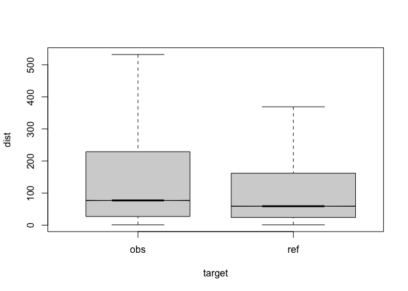
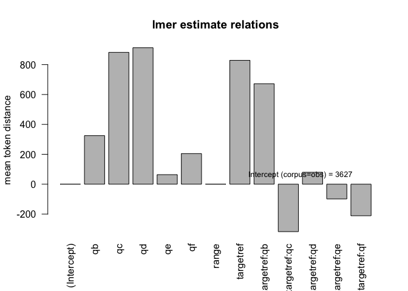

``` r
#dataset<-7
```

# top

eval output M7

| variable | explanation         | values                |
|:---------|:--------------------|:----------------------|
| target   | corpus              | obs,ref               |
| q        | condition           | a,b,c,d,e,f           |
| det      | antecedent POS==DET | TRUE,FALSE            |
| q:a      | query condition     | .\*                   |
| q:b      | query condition     | this,that,those,these |
| q:c      | query condition     | the                   |
| q:d      | query condition     | a,an,any,some         |
| q:e      | query condition     | my                    |
| q:f      | query condition     | his,her,their,your    |

model vars

    ## [1] "anova plain"

    ##                  Df     Sum Sq    Mean Sq   F value    Pr(>F)    
    ## target            1 1.2468e+09 1.2468e+09    4.8904   0.02701 *  
    ## q                 5 1.9771e+11 3.9542e+10  155.0977 < 2.2e-16 ***
    ## det               1 1.0423e+12 1.0423e+12 4088.5056 < 2.2e-16 ***
    ## target:q          5 6.9820e+09 1.3964e+09    5.4772 4.797e-05 ***
    ## target:det        1 2.0619e+10 2.0619e+10   80.8767 < 2.2e-16 ***
    ## q:det             3 9.6954e+11 3.2318e+11 1267.6353 < 2.2e-16 ***
    ## target:q:det      3 2.1915e+10 7.3049e+09   28.6527 < 2.2e-16 ***
    ## Residuals    939859 2.3961e+14 2.5495e+08                        
    ## ---
    ## Signif. codes:  0 '***' 0.001 '**' 0.01 '*' 0.05 '.' 0.1 ' ' 1

    ## [1] "anova of linear regression model"

    ## Type III Analysis of Variance Table with Satterthwaite's method
    ##              Sum Sq    Mean Sq NumDF  DenDF  F value    Pr(>F)    
    ## target   2.2770e+10 2.2770e+10     1 932378  91.8099 < 2.2e-16 ***
    ## q        7.4978e+10 1.4996e+10     5 938966  60.4629 < 2.2e-16 ***
    ## range    3.9967e+10 3.9967e+10     1 933313 161.1487 < 2.2e-16 ***
    ## target:q 4.3533e+09 8.7066e+08     5 938887   3.5106  0.003563 ** 
    ## ---
    ## Signif. codes:  0 '***' 0.001 '**' 0.01 '*' 0.05 '.' 0.1 ' ' 1

    ## [1] "lmer coefficients"

    ##                  Estimate   Std. Error           df     t value     Pr(>|t|)
    ## (Intercept)  3627.0768655 2.862226e+03 1.043945e+00   1.2672225 4.185783e-01
    ## targetref     828.5368406 6.076557e+01 8.895688e+05  13.6349716 2.505347e-42
    ## qb            324.9721102 1.608094e+02 9.389839e+05   2.0208526 4.329530e-02
    ## qc            882.0629380 1.068461e+02 9.394977e+05   8.2554551 1.515171e-16
    ## qd            913.0578719 1.112616e+02 9.397668e+05   8.2064060 2.281910e-16
    ## qe             63.7928283 1.320875e+02 9.389772e+05   0.4829589 6.291250e-01
    ## qf            204.7164407 1.618487e+02 9.389412e+05   1.2648628 2.059208e-01
    ## range          -0.1277011 1.005961e-02 9.333130e+05 -12.6944357 6.393452e-37
    ## targetref:qb  672.2718571 2.210629e+02 9.385871e+05   3.0410890 2.357306e-03
    ## targetref:qc -317.5242989 1.291365e+02 9.392557e+05  -2.4588277 1.393933e-02
    ## targetref:qd   79.8588196 1.400112e+02 9.395700e+05   0.5703743 5.684240e-01
    ## targetref:qe  -98.5319632 2.607983e+02 9.381571e+05  -0.3778090 7.055726e-01
    ## targetref:qf -211.3458451 2.219379e+02 9.388365e+05  -0.9522746 3.409580e-01

<figure>

<figcaption aria-hidden="true">compare distances by corpus</figcaption>
</figure>

<figure>

<figcaption aria-hidden="true">median distances over query/corpus</figcaption>
</figure>

<figure>

<figcaption aria-hidden="true">distances relation</figcaption>
</figure>

------------------------------------------------------------------------

# REF

literature used and alii…

Bates, Douglas, Martin Mächler, Ben Bolker, and Steve Walker. 2015. “Fitting Linear Mixed-Effects Models Using Lme4.” *Journal of Statistical Software* 67 (1): 1–48. <https://doi.org/10.18637/jss.v067.i01>.

De Marneffe, Marie-Catherine, Christopher D. Manning, Joakim Nivre, and Daniel Zeman. 2021. “Universal Dependencies.” *Computational Linguistics*, May, 1–54. <https://doi.org/10.1162/coli_a_00402>.

Prince, Ellen F. 1981. “Toward a Taxonomy of Given-New Information.” In *Syntax and Semantics: Vol. 14. Radical Pragmatics*, edited by P. Cole, 223–55. New York: Academic Press.

Wijffels, Jan. 2023. *Udpipe: Tokenization, Parts of Speech Tagging, Lemmatization and Dependency Parsing with the ’UDPipe’ ’NLP’ Toolkit*. <https://CRAN.R-project.org/package=udpipe>.

Zimmerer, Vitor C., Stuart Watson, Douglas Turkington, I. Nicol Ferrier, and Wolfram Hinzen. 2017. “Deictic and Propositional Meaning—New Perspectives on Language in Schizophrenia.” *Frontiers in Psychiatry* 8 (February). <https://doi.org/10.3389/fpsyt.2017.00017>.
