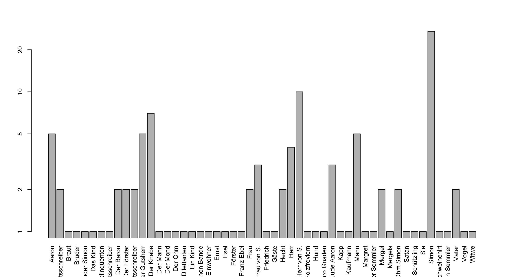
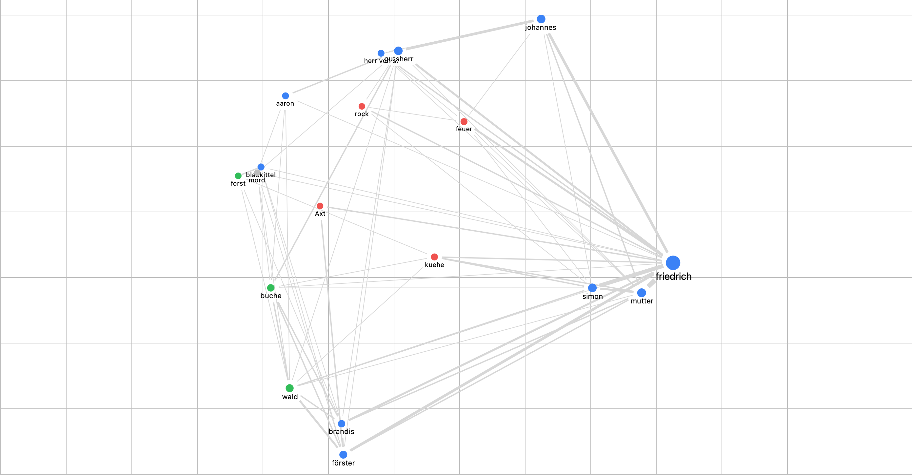

```{r setup, include=FALSE}
knitr::opts_chunk$set(echo = TRUE)
```
contains distant reading essais VS Michael Auer/FUB-SoSe24

#### 1.droste-hülshoff: judenbuche
- get book from gutenberg.org
- extract named entities
- plot named entity occurences over text

```{r plot-ner,fig.cap="named entities"}
load("ner.plot.RData")
plot(ner.plot,type="h",main="named entities over text",xlab="characters (chars, not figures)")

```

#### analysis
assuming that characters (named entities) in the text happen to appear often in dialogues, one could say, that the beginning and the middle of the *judenbuche* is poor of dialogue and of more epic style, since as you see there are fewer occurences of NE.


mentions distribution of figures in the text


network essai of acteurs


```{r plot-ner-table,fig.cap="named entity distribution"}
#load("ner.table.RData")
#par(las=3)
#barplot(ner.t,horiz = F,log = "y",xpd = T,beside = T)
```
-----
#### references
script: [droste-essai.R](droste-essai.R)