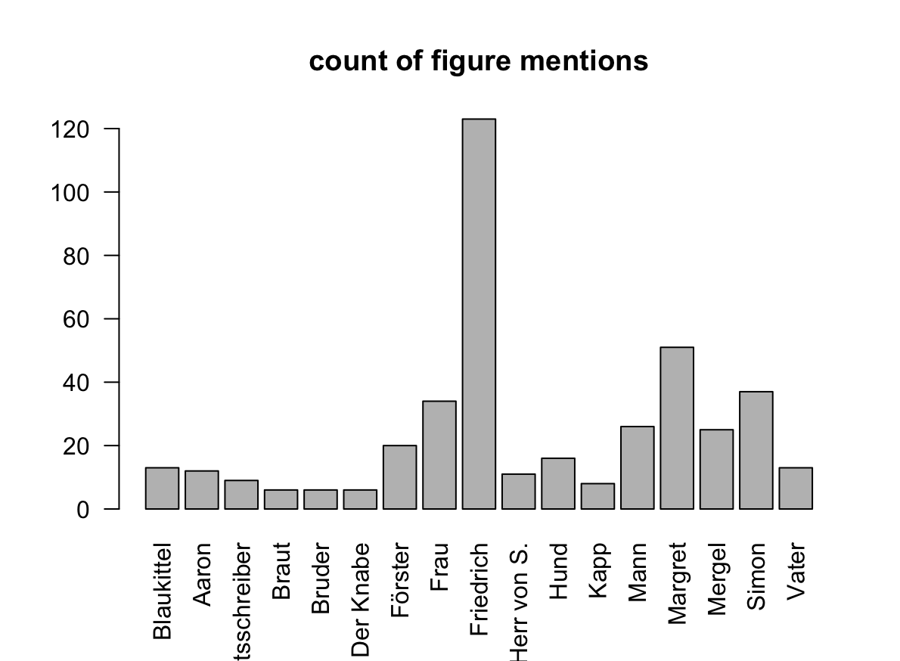
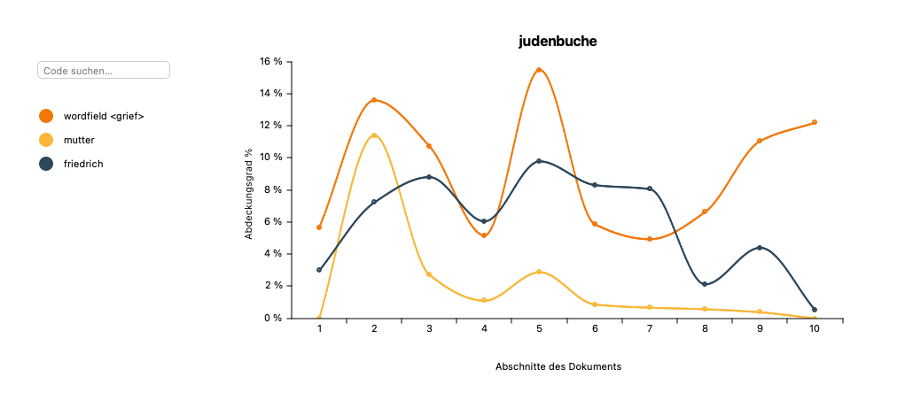

```{r setup, include=FALSE}
knitr::opts_chunk$set(echo = TRUE)
```
contains distant reading essais VS Michael Auer/FUB-SoSe24

# 1.droste-hülshoff: judenbuche
- get book from gutenberg.org
- extract named entities
- plot named entity occurences over text

```{r plot-ner,fig.cap="named entities"}
load("ner.plot.RData")
plot(ner.plot,type="h",main="named entities over text",xlab="characters (chars, not figures)")

```

```{r plot-ner-testq,eval=F,echo=F,fig.cap="<button>named entities</button>",dev='svg',size=500}
# high quality figure output: 25KB:25MB
load("ner.plot.RData")
plot(ner.plot,type="h",main="named entities over text",xlab="characters (chars, not figures)")

```

# analysis
assuming that characters (named entities) in the text happen to appear often in dialogues, one could say, that the beginning and the middle of the *judenbuche* is poor of dialogue and of more epic style, since as you see there are fewer occurences of NE.

----
 mentions distribution of figures in the text
 network essai of acteurs, Q: MAXQDA
 network essai of acteurs, Q: Data - MAXQDA, Grafix - Gephi
----

## analysis for [grievability]
referring [@butler_what_2022]

- coding of wordfield [grief] occurences
  - regex search in MAXQDA, using the following
  
```{r, echo=FALSE}
t<-readLines("regex.mod.sea")
print(t[5])
```

 grief wordfield plot, MAXQDA

-----
# REF
- script: [droste-essai.R](droste-essai.R)
- coding: R, MAXQDA
- network: MAXQDA, Gephi
