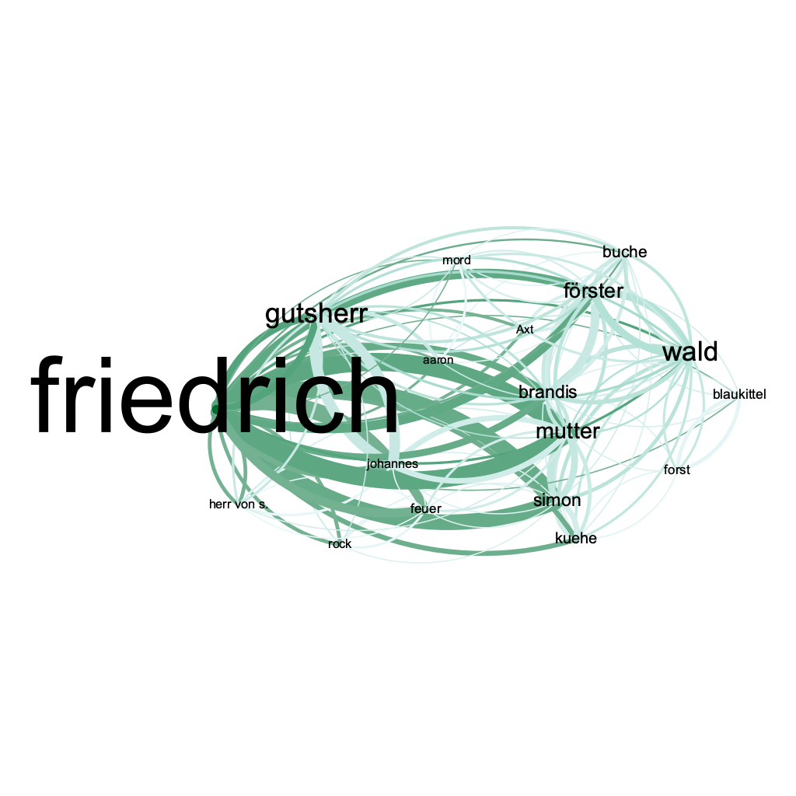

VS Auer distant reading
================

contains distant reading essais VS Michael Auer/FUB-SoSe24

# 1.droste-hülshoff: judenbuche

- get book from gutenberg.org
- extract named entities
- plot named entity occurences over text

``` r
load("ner.plot.RData")
plot(ner.plot,type="h",main="named entities over text",xlab="characters (chars, not figures)")
```

<figure>

<figcaption aria-hidden="true">named entities</figcaption>
</figure>

# analysis

assuming that characters (named entities) in the text happen to appear
often in dialogues, one could say, that the beginning and the middle of
the *judenbuche* is poor of dialogue and of more epic style, since as
you see there are fewer occurences of NE.

|  mentions distribution of figures in the text |
|----------------------------------------------------------------|
|  network essai of acteurs, Q: MAXQDA    |

 network essai of acteurs, Q: Data - MAXQDA,
Grafix - Gephi

## analysis for \[grievability\]

referring (Butler 2022)

- coding of wordfield occurences
  - regex search in MAXQDA, using the following

<!-- -->

    ## [1] " <PROPERTY id=\"0\">ernst|Armut|\\barm|(\\btot)|schrecklich|(laß mich)|krank|seufz|Schmerz|schmerz|krampf|übel|jammer|Jammer|ächz|sterben|Sterben|sampleregex-2</PROPERTY>"

 grief wordfield plot, MAXQDA

------------------------------------------------------------------------

# REF

- script: [droste-essai.R](droste-essai.R)
- coding: R, MAXQDA
- network: MAXQDA, Gephi

<div id="refs" class="references csl-bib-body hanging-indent"
entry-spacing="0">

<div id="ref-butler_what_2022" class="csl-entry">

Butler, Judith. 2022. *What World Is This?: A Pandemic Phenomenology /
Judith Butler.* New Nork: Columbia University Press.

</div>

</div>
