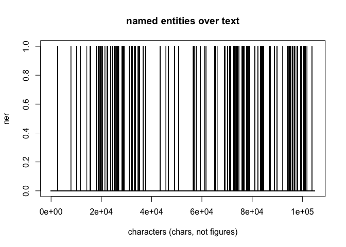

VS Auer distant reading
================

contains distant reading essais VS Michael Auer/FUB-SoSe24

#### 1.droste-hülshoff: judenbuche

- get book from gutenberg.org
- extract named entities
- plot named entity occurences over text

``` r
load("ner.plot.RData")
plot(ner.plot,type="h",main="named entities over text",xlab="characters (chars, not figures)")
```

<figure>

<figcaption aria-hidden="true">named entities</figcaption>
</figure>

#### analysis

assuming that characters (named entities) in the text happen to appear
often in dialogues, one could say, that the beginning and the middle of
the *judenbuche* is poor of dialogue and of more epic style, since as
you see there are fewer occurences of NE.

 mentions distribution of figures in the text

``` r
#load("ner.table.RData")
#par(las=3)
#barplot(ner.t,horiz = F,log = "y",xpd = T,beside = T)
```

------------------------------------------------------------------------

#### references

script: [droste-essai.R](droste-essai.R)
